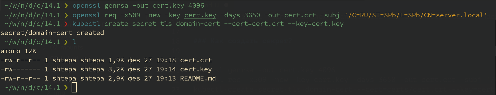
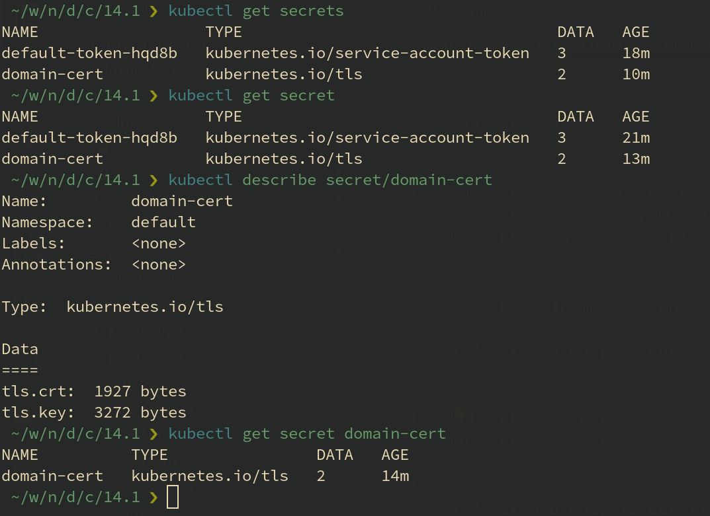
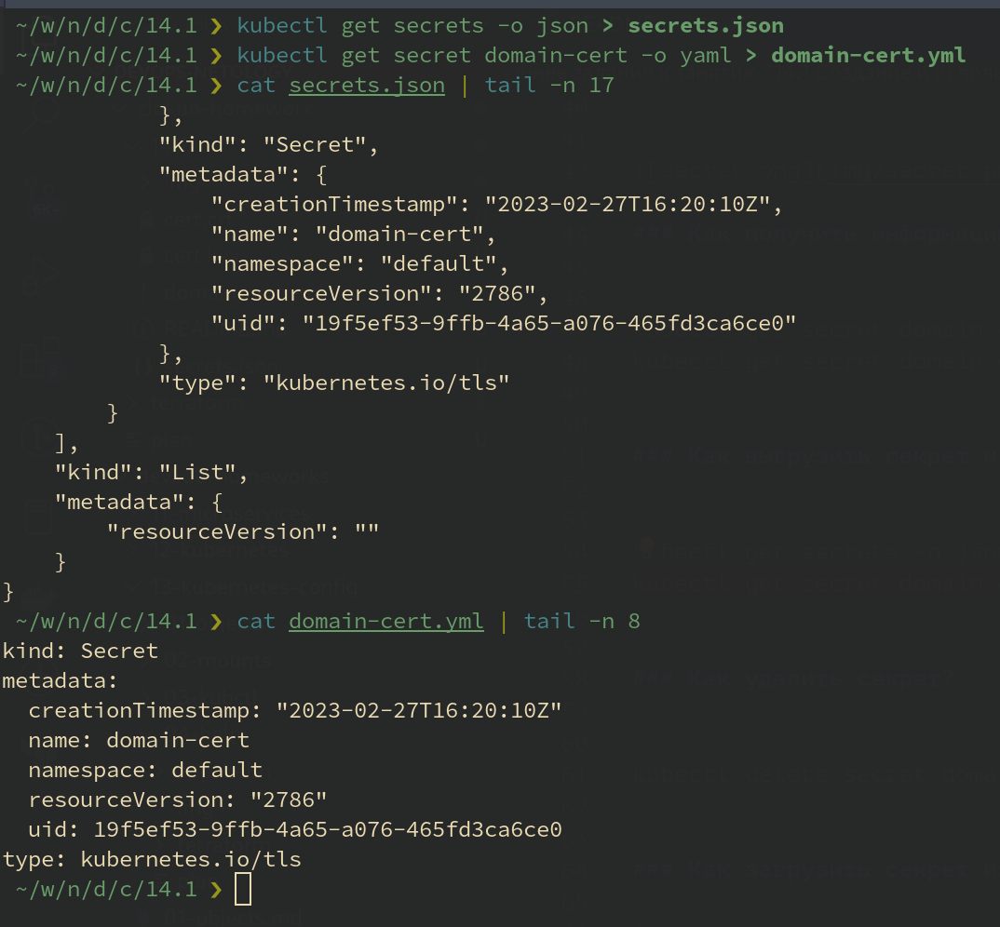
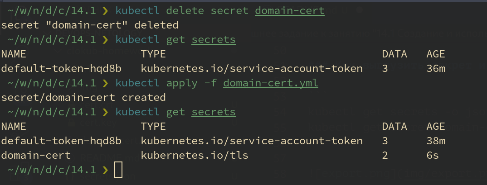

# Домашнее задание к занятию "14.1 Создание и использование секретов"

## Задача 1: Работа с секретами через утилиту kubectl в установленном minikube

> Выполните приведённые ниже команды в консоли, получите вывод команд. Сохраните
> задачу 1 как справочный материал.

Вместо `minikube` использовался `Managed Service for Kubernetes` Yandex Cloud.

Для автоматизации процесса развёртывания кластера Kubernetes применены [манифесты Terraform](../terraform/) и [скрипт запуска](../plan).

```ShellSession
cd ..
./plan init
./plan apply
```

### Как создать секрет?

```ShellSession
openssl genrsa -out cert.key 4096
openssl req -x509 -new -key cert.key -days 3650 -out cert.crt -subj '/C=RU/ST=Moscow/L=Moscow/CN=server.local'
kubectl create secret tls domain-cert --cert=certs/cert.crt --key=certs/cert.key
```



### Как просмотреть список секретов?

```ShellSession
kubectl get secrets
kubectl get secret
```

### Как просмотреть секрет?

```ShellSession
kubectl get secret domain-cert
kubectl describe secret domain-cert
```



### Как получить информацию в формате YAML и/или JSON?

```ShellSession
kubectl get secret domain-cert -o yaml
kubectl get secret domain-cert -o json
```

### Как выгрузить секрет и сохранить его в файл?

```ShellSession
kubectl get secrets -o json > secrets.json
kubectl get secret domain-cert -o yaml > domain-cert.yml
```



### Как удалить секрет?

```ShellSession
kubectl delete secret domain-cert
```

### Как загрузить секрет из файла?

```ShellSession
kubectl apply -f domain-cert.yml
```



## Задача 2 (*): Работа с секретами внутри модуля

Выберите любимый образ контейнера, подключите секреты и проверьте их доступность
как в виде переменных окружения, так и в виде примонтированного тома.

---

### Как оформить ДЗ?

Выполненное домашнее задание пришлите ссылкой на .md-файл в вашем репозитории.

В качестве решения прикрепите к ДЗ конфиг файлы для деплоя. Прикрепите скриншоты вывода команды kubectl со списком запущенных объектов каждого типа (deployments, pods, secrets) или скриншот из самого Kubernetes, что сервисы подняты и работают, а также вывод из CLI.

---
