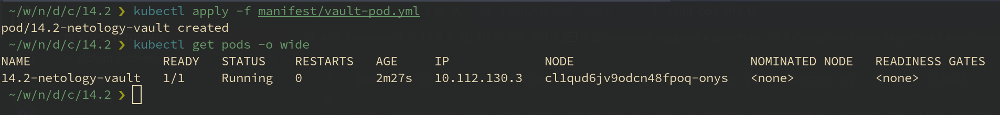
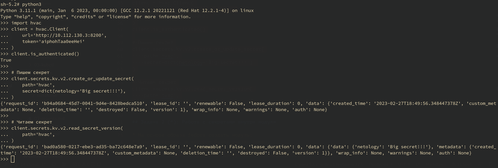
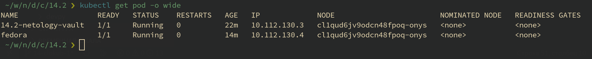

# Домашнее задание к занятию "14.2 Синхронизация секретов с внешними сервисами. Vault"

## Задача 1: Работа с модулем Vault

> Запустить модуль Vault конфигураций через утилиту kubectl в установленном minikube

Вместо `minikube` использовался `Managed Service for Kubernetes` Yandex Cloud.

Для автоматизации процесса развёртывания кластера Kubernetes применены [манифесты Terraform](../terraform/) и [скрипт запуска](../plan).

```ShellSession
cd ..
./plan init
./plan apply
```

Запустил модуль Vault конфигураций через утилиту kubectl

```ShellSession
kubectl apply -f manifest/vault-pod.yml
```



> Получить значение внутреннего IP пода

```ShellSession
kubectl get pod 14.2-netology-vault -o json | jq -c '.status.podIPs'
```

> Примечание: jq - утилита для работы с JSON в командной строке


> Запустить второй модуль для использования в качестве клиента

```ShellSession
kubectl run -i --tty fedora --image=fedora --restart=Never -- sh
```

> Установить дополнительные пакеты

```ShellSession
dnf -y install pip
pip install hvac
```

> Запустить интепретатор Python и выполнить следующий код, предварительно
> поменяв IP и токен

```python
import hvac
client = hvac.Client(
    url='http://10.112.130.3:8200',
    token='aiphohTaa0eeHei'
)
client.is_authenticated()

# Пишем секрет
client.secrets.kv.v2.create_or_update_secret(
    path='hvac',
    secret=dict(netology='Big secret!!!'),
)

# Читаем секрет
client.secrets.kv.v2.read_secret_version(
    path='hvac',
)
```
Код на python сохраняет секрет в хранилище Vault и считывает его:



Запущенные в это время поды кластера:



## Задача 2 (*): Работа с секретами внутри модуля

* На основе образа fedora создать модуль;
* Создать секрет, в котором будет указан токен;
* Подключить секрет к модулю;
* Запустить модуль и проверить доступность сервиса Vault.

---

### Как оформить ДЗ?

Выполненное домашнее задание пришлите ссылкой на .md-файл в вашем репозитории.

В качестве решения прикрепите к ДЗ конфиг файлы для деплоя. Прикрепите скриншоты вывода команды kubectl со списком запущенных объектов каждого типа (pods, deployments, statefulset, service) или скриншот из самого Kubernetes, что сервисы подняты и работают, а также вывод из CLI.

---
