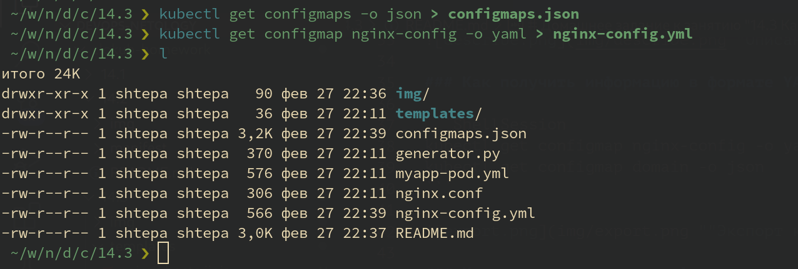

# Домашнее задание к занятию "14.3 Карты конфигураций"

## Задача 1: Работа с картами конфигураций через утилиту kubectl в установленном minikube

> Выполните приведённые команды в консоли. Получите вывод команд. Сохраните
> задачу 1 как справочный материал.

### Как создать карту конфигураций?

```ShellSession
kubectl create configmap nginx-config --from-file=nginx.conf
kubectl create configmap domain --from-literal=name=netology.ru
```


### Как просмотреть список карт конфигураций?

```ShellSession
kubectl get configmaps
kubectl get configmap
```


### Как просмотреть карту конфигурации?

```ShellSession
kubectl get configmap nginx-config
kubectl describe configmap domain
```


### Как получить информацию в формате YAML и/или JSON?

```ShellSession
kubectl get configmap nginx-config -o yaml
kubectl get configmap domain -o json
```


### Как выгрузить карту конфигурации и сохранить его в файл?

```ShellSession
kubectl get configmaps -o json > configmaps.json
kubectl get configmap nginx-config -o yaml > nginx-config.yml
```



### Как удалить карту конфигурации?

```ShellSession
kubectl delete configmap nginx-config
```


### Как загрузить карту конфигурации из файла?

```ShellSession
kubectl apply -f nginx-config.yml
```


## Задача 2 (*): Работа с картами конфигураций внутри модуля

Выбрать любимый образ контейнера, подключить карты конфигураций и проверить
их доступность как в виде переменных окружения, так и в виде примонтированного
тома

---

### Как оформить ДЗ?

Выполненное домашнее задание пришлите ссылкой на .md-файл в вашем репозитории.

В качестве решения прикрепите к ДЗ конфиг файлы для деплоя. Прикрепите скриншоты вывода команды kubectl со списком запущенных объектов каждого типа (pods, deployments, configmaps) или скриншот из самого Kubernetes, что сервисы подняты и работают, а также вывод из CLI.

---
