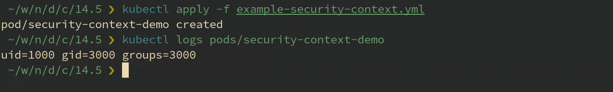

# Домашнее задание к занятию "14.5 SecurityContext, NetworkPolicies"

## Задача 1: Рассмотрите пример 14.5/example-security-context.yml

Для создания кластера использовался `Managed Service for Kubernetes` Yandex Cloud.

Для автоматизации процесса развёртывания кластера Kubernetes применены [манифесты Terraform](../terraform/) и [скрипт запуска](../plan).

```ShellSession
cd ..
./plan init
./plan apply
```

Создал модуль на основе манифеста `example-security-context.yml`

```yaml
---
apiVersion: v1
kind: Pod
metadata:
  name: security-context-demo
spec:
  containers:
  - name: sec-ctx-demo
    image: fedora:latest
    command: [ "id" ]
    # command: [ "sh", "-c", "sleep 1h" ]
    securityContext:
      runAsUser: 1000
      runAsGroup: 3000
...
```

```ShellSession
kubectl apply -f example-security-context.yml
```

Проверил установленные настройки внутри контейнера

```ShellSession
kubectl logs security-context-demo
```



В манифесте `example-security-context.yml` создаётся:

- под с именем security-context-demo;
- в поде разворачивается один контейнер с именем sec-ctx-demo на основе образа fedora:latest;
- в контейнере выполняется команда `id`, выводящая уникальный идентификатор пользователя (UUID) от которого запускается контейнер, идентификатор его группы (GID) и идентификаторы групп (GROUPS), в которые входит пользователь;
- для контейнера задан `securityContext`, в котором указано, что контейнер нужно запускать от пользователя с UUID=1000 (`runAsUser: 1000`), и группы GID=3000 (`runAsGroup: 3000`);
- после применения манифеста под создаётся, запускается, отработает команда `id` и под завершает работу, сохранив в своих логах вывод команды.

## Задача 2 (*): Рассмотрите пример 14.5/example-network-policy.yml

Создайте два модуля. Для первого модуля разрешите доступ к внешнему миру
и ко второму контейнеру. Для второго модуля разрешите связь только с
первым контейнером. Проверьте корректность настроек.

---

### Как оформить ДЗ?

Выполненное домашнее задание пришлите ссылкой на .md-файл в вашем репозитории.

В качестве решения прикрепите к ДЗ конфиг файлы для деплоя. Прикрепите скриншоты вывода команды kubectl со списком запущенных объектов каждого типа (pods, deployments, statefulset, service) или скриншот из самого Kubernetes, что сервисы подняты и работают, а также вывод из CLI.

---
