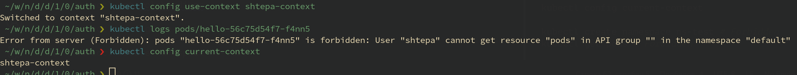
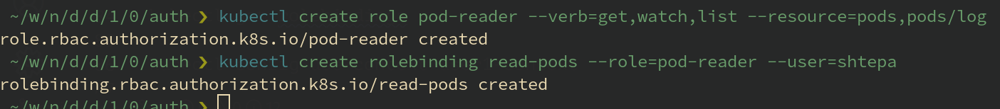

# Домашнее задание к занятию "12.2 Команды для работы с Kubernetes"
Кластер — это сложная система, с которой крайне редко работает один человек. Квалифицированный devops умеет наладить работу всей команды, занимающейся каким-либо сервисом.
После знакомства с кластером вас попросили выдать доступ нескольким разработчикам. Помимо этого требуется служебный аккаунт для просмотра логов.

## Задание 1: Запуск пода из образа в деплойменте
Для начала следует разобраться с прямым запуском приложений из консоли. Такой подход поможет быстро развернуть инструменты отладки в кластере. Требуется запустить деплоймент на основе образа из hello world уже через deployment. Сразу стоит запустить 2 копии приложения (replicas=2). 

Требования:
 * пример из hello world запущен в качестве deployment
 * количество реплик в deployment установлено в 2
 * наличие deployment можно проверить командой kubectl get deployment
 * наличие подов можно проверить командой kubectl get pods

### Решение


## Задание 2: Просмотр логов для разработки
Разработчикам крайне важно получать обратную связь от штатно работающего приложения и, еще важнее, об ошибках в его работе. 
Требуется создать пользователя и выдать ему доступ на чтение конфигурации и логов подов в app-namespace.

Требования: 
 * создан новый токен доступа для пользователя
 * пользователь прописан в локальный конфиг (~/.kube/config, блок users)
 * пользователь может просматривать логи подов и их конфигурацию (kubectl logs pod <pod_id>, kubectl describe pod <pod_id>)

### Решение

1. Формируем закрытый клюк для клиентского сертификата, который понадобится для подключения к kubernetes:
    ```bash
    openssl genrsa -out shtepa.key 2048
    ```
1. Формируем открытый ключ (для проверки сертификата):
    ```bash
    openssl req -new -key shtepa.key -out shtepa.csr -subj "/CN=shtepa/O=netology"
    ```
1. Далее формируем клиентский сертификат используя корневой сертификат kubernetes (в нашем случае это minikube):
    ```bash
    openssl x509 -req -in shtepa.csr -CA ~/.minikube/ca.crt     -CAkey ~/.minikube/ca.key -CAcreateserial -out shtepa.crt -days 500
    ```
1. Привязываем клиентский сертификат к пользователю kubernates:
   ```bash
    kubectl config set-credentials shtepa --client-certificate=shtepa.crt --client-key=shtepa.key
    ```
1. Создаём контекст внутри пространства имён `default` кластера `minikube`:
    ```bash
    kubectl config set-context shtepa-context --cluster=minikube --namespace=default --user=shtepa
    ```
1. Проверяем сохранённые настройки контекста и сертификата пользователя:
    ```bash
    kubectl config view
    ```

    

1. Переключим контекст и проверим доступ к логам подов:
    ```bash
    kubectl config use-context user1-context

    kubectl config current-context

    kubectl logs pods/hello # Forbidden
    ```

    

1. Создаём роль и связываем её с пользователем:
    ```bash
    kubectl config use-context minikube

    kubectl create role pod-reader --verb=get,watch,list --resource=pods,pods/log

    kubectl create rolebinding read-pods --role=pod-reader --user=shtepa
    ```

    

1. Проверяем доступ к логам в контексте пользователя:
    ```bash
    kubectl config use-context shtepa-context

    kubectl get pods

    kubectl logs pods/hello
    ```

    

## Задание 3: Изменение количества реплик 
Поработав с приложением, вы получили запрос на увеличение количества реплик приложения для нагрузки. Необходимо изменить запущенный deployment, увеличив количество реплик до 5. Посмотрите статус запущенных подов после увеличения реплик. 

Требования:
 * в deployment из задания 1 изменено количество реплик на 5
 * проверить что все поды перешли в статус running (kubectl get pods)

### Решение

Для изменения количества реплик необходимо изменить параметр `replicas` в настройках deployment hello:

```bash
kubectl edit deployment hello
```


А так же можно воспользоваться командой масштабирования:

```bash
kubectl scale deployment hello --replicas=5
```
