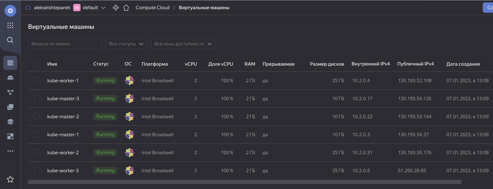
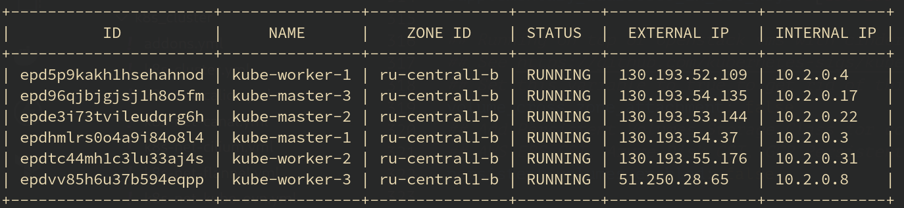
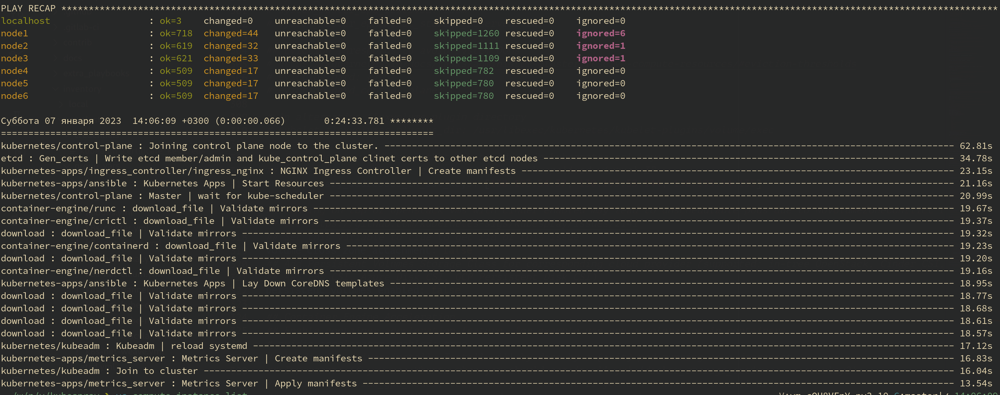
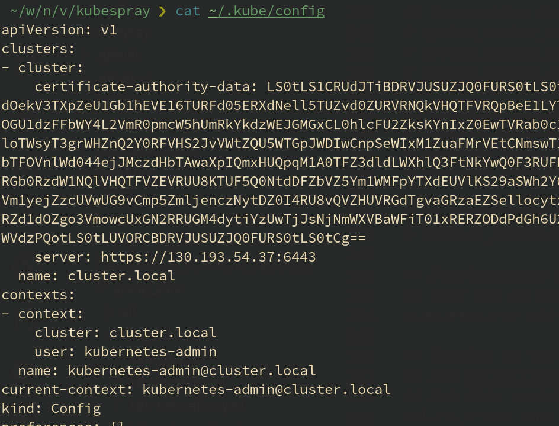

# Домашнее задание к занятию "12.4 Развертывание кластера на собственных серверах, лекция 2"
Новые проекты пошли стабильным потоком. Каждый проект требует себе несколько кластеров: под тесты и продуктив. Делать все руками — не вариант, поэтому стоит автоматизировать подготовку новых кластеров.

## Задание 1: Подготовить инвентарь kubespray
Новые тестовые кластеры требуют типичных простых настроек. Нужно подготовить инвентарь и проверить его работу. Требования к инвентарю:
* подготовка работы кластера из 5 нод: 1 мастер и 4 рабочие ноды;
* в качестве CRI — containerd;
* запуск etcd производить на мастере.

## Задание 2 (*): подготовить и проверить инвентарь для кластера в AWS
Часть новых проектов хотят запускать на мощностях AWS. Требования похожи:
* разворачивать 5 нод: 1 мастер и 4 рабочие ноды;
* работать должны на минимально допустимых EC2 — t3.small.

---

## Решение

В рамках выполнения домашнего задания `"Задание 1"` и `"Задание 2"` объединены и уточнены условия:

- подготовить в Yandex Cloud шесть виртуальных машин: три узла Control plane и три  узла Kube node;
- подготовить инвентарь из полученных машин для Kubespray;
- в качестве CRI — containerd;
- запуск etcd производить на мастере.

1. В Yandex Cloud создано шесть виртуальных машин. Три машины для Control plane (`kube-master-1`, `kube-master-2`, `kube-master-3`) и три машины Kube node (`kube-worker-1`, `kube-worker-2`, `kube-worker-3`):

    

1. Получены внешние IP-адреса виртуальных машин:

    ```bash
    yc compute instance list
    ```

    

1. Извлечён из репозитория проект `Kubespray`:
   
   ```bash
   git clone https://github.com/kubernetes-sigs/kubespray
   ```

1. С помощью Kubespray inventory generator подготовлен файл инвентаря для Ansible:
   
   ```bash
   CONFIG_FILE=inventory/mycluster/hosts.yml python3 contrib/inventory_builder/inventory.py 130.193.54.37 130.193.53.144 130.193.54.135 130.193.52.109 130.193.55.176 51.250.28.65
    ```

1. Сформированный [файл инвентаря](./04-install/kubespray.files/inventory/mycluster/hosts.yml) требует доработки - необходимо указать хосты выполняющие роли Contol plane, Kube node, etcd, а тек же указать системного пользователя для подключения.

    <details>
        <summary>Файл инвенторя host.yml</summary>

    ```yaml
    all:
      hosts:
        node1:
          ansible_host: 130.193.54.37
          ansible_user: centos
        node2:
          ansible_host: 130.193.53.144
          ansible_user: centos
        node3:
          ansible_host: 130.193.54.135
          ansible_user: centos
        node4:
          ansible_host: 130.193.52.109
          ansible_user: centos
        node5:
          ansible_host: 130.193.55.176
          ansible_user: centos
        node6:
          ansible_host: 51.250.28.65
          ansible_user: centos
      children:
        kube_control_plane:
          hosts:
            node1:
            node2:
            node3:
        kube_node:
          hosts:
            node4:
            node5:
            node6:
        etcd:
          hosts:
            node1:
            node2:
            node3:
        k8s_cluster:
          children:
            kube_control_plane:
            kube_node:
        calico_rr:
          hosts: {}
    ```
    </details>

1.  В переменных инвентаря (файл [k8s-cluster.yml](./04-install/kubespray.files/inventory/mycluster/group_vars/k8s_cluster/k8s-cluster.yml)) необходимо указать перечень узлов Control plane для формирования SSL-сертификатов.

    ```yaml
    ## Supplementary addresses that can be added in kubernetes ssl keys.
    ## That can be useful for example to setup a keepalived virtual IP
    supplementary_addresses_in_ssl_keys: [130.193.54.37, 130.193.53.144, 130.193.54.135]
    ```

1. В том же файле инвентаря [k8s-cluster.yml](./04-install/kubespray.files/inventory/mycluster/group_vars/k8s_cluster/k8s-cluster.yml) указываем в качестве container runtime interface `containerd`:

    ```yaml
    ## Container runtime
    ## docker for docker, crio for cri-o and containerd for containerd.
    ## Default: containerd
    container_manager: containerd
    ```

1. Kubernetes Addons можно настроить в файле инвентаря [addons.yml](./04-install/kubespray.files/inventory/mycluster/group_vars/k8s_cluster/addons.yml)

1. Конфигурируем виртуальные машины и разворачиваем Kubernetes в Yandex Cloud:

    ```bash
    ansible-playbook -i inventory/mycluster/hosts.yml cluster.yml -vb
    ```

    

1. По SSH подключаемся к одной из Control node и забираем файл `/etc/kubernetes/admin.conf`.

1. Полученный файл сохраняем локально в `~/.kube/config` и правим в нём адрес Cluster API `server` c "127.0.0.1" на IP-адрес Control plane:

    

1. проверяем работу кластера:

    ```bash
    kubectl get nodes
    ```

    

