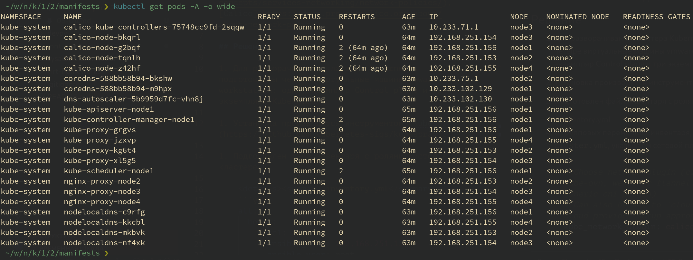
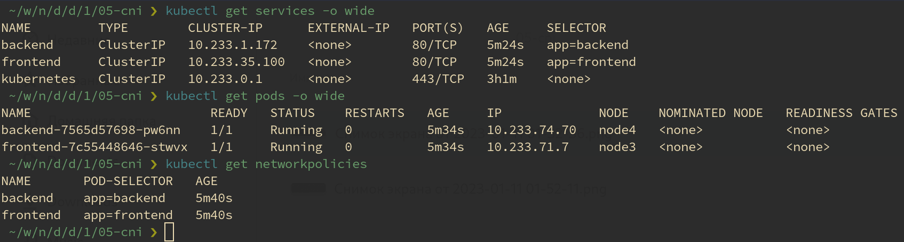
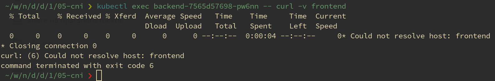
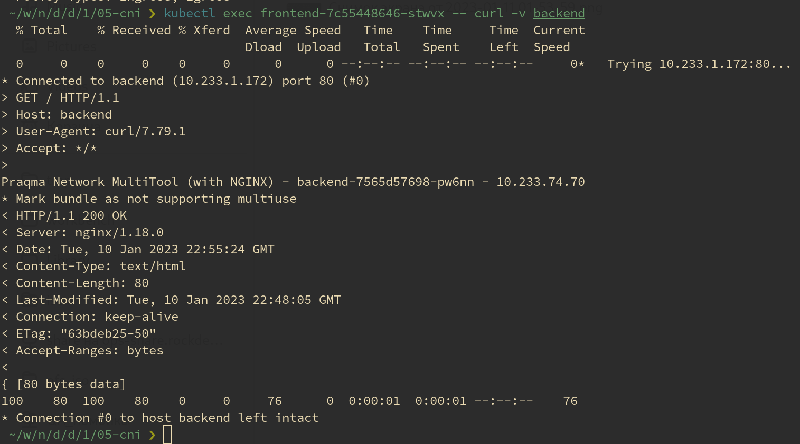
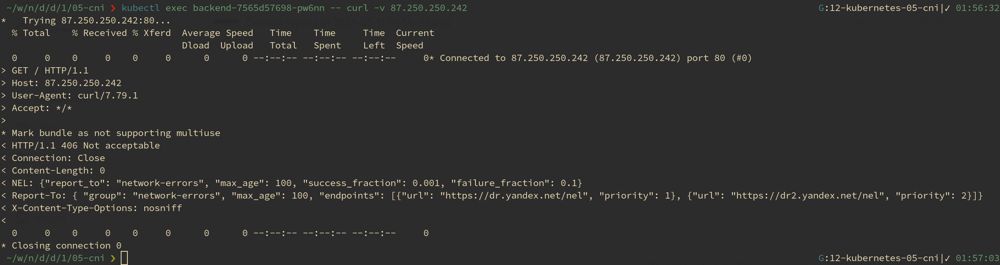

# Домашнее задание к занятию "12.5 Сетевые решения CNI"
После работы с Flannel появилась необходимость обеспечить безопасность для приложения. Для этого лучше всего подойдет Calico.
## Задание 1: установить в кластер CNI плагин Calico
Для проверки других сетевых решений стоит поставить отличный от Flannel плагин — например, Calico. Требования: 
* установка производится через ansible/kubespray;
* после применения следует настроить политику доступа к hello-world извне. Инструкции [kubernetes.io](https://kubernetes.io/docs/concepts/services-networking/network-policies/), [Calico](https://docs.projectcalico.org/about/about-network-policy)

## Решение

1. Для разворачивания кластера Kubernetes подготовлены четыре виртуальные машины vmware workstation: один экземпляр Control plane и три экземпляра Kube node.

1. Установка производится инструментом [Kubespray](https://github.com/kubernetes-sigs/kubespray).

1. Подготовлен файл инвентаря с ролями хостов в кластере.

    <details><summary>inventory.yml</summary>
    ```yaml
    all:
      hosts:
        node1:
          ansible_host: 192.168.251.156
          ansible_user: root  
        node2:
          ansible_host: 192.168.251.153
          ansible_user: root  
        node3:
          ansible_host: 192.168.251.154
          ansible_user: root  
        node4:
          ansible_host: 192.168.251.155
          ansible_user: root  
      children:
        kube_control_plane:
          hosts:
            node1:
        kube_node:
          hosts:
            node2:
            node3:
            node4:
        etcd:
          hosts:
            node1:
        k8s_cluster:
          children:
            kube_control_plane:
            kube_node:
        calico_rr:
          hosts: {}
    ```
    </details>

1. В групповых переменных инвентаря, файл `k8s-cluster.yml`, указываем сетевой плагин `Calico`.

    ```yaml
    # Choose network plugin (cilium, calico, kube-ovn, weave or flannel. Use cni for generic cni plugin)
    # Can also be set to 'cloud', which lets the cloud provider setup appropriate routing
    kube_network_plugin: calico
    ```

1. Развернул кластер Kubernetes средствами Kubespray.

    

1. Вместо сервиса hello-world решил развернуть два сервиса multi-tools. Для этого подготовил манифесты для двух сервисов: [backend](./05-cni/backend.yml) и [frontend](./05-cni/fronend.yml).

    <details><summary>backend.yml</summary>

    ```yaml
    ---
    apiVersion: apps/v1
    kind: Deployment
    metadata:
      labels:
        app: backend
      name: backend
      namespace: default
    spec:
      replicas: 1
      selector:
        matchLabels:
          app: backend
      template:
        metadata:
          labels:
            app: backend
        spec:
          containers:
            - image: praqma/network-multitool:alpine-extra
              imagePullPolicy: IfNotPresent
              name: network-multitool
          terminationGracePeriodSeconds: 30

    ---
    apiVersion: v1
    kind: Service
    metadata:
      name: backend
      namespace: default
    spec:
      ports:
        - name: web
          port: 80
      selector:
        app: backend

    ---
    apiVersion: networking.k8s.io/v1
    kind: NetworkPolicy
    metadata:
      name: backend
      namespace: default
    spec:
      podSelector:
        matchLabels:
          app: backend
      policyTypes:
        - Ingress
        - Egress
      ingress:
        - from:
          - podSelector:
              matchLabels:
                app: frontend
          ports:
            - protocol: TCP
              port: 80
      egress:
        - to:
          - ipBlock:
              cidr: 87.250.250.242/24
          ports:
            - protocol: TCP
              port: 80
    ```
    </details>

    <details><summary>frontend.yml</summary>

    ```yaml
    ---
    apiVersion: apps/v1
    kind: Deployment
    metadata:
      labels:
        app: frontend
      name: frontend
      namespace: default
    spec:
      replicas: 1
      selector:
        matchLabels:
          app: frontend
      template:
        metadata:
          labels:
            app: frontend
        spec:
          containers:
            - image: praqma/network-multitool:alpine-extra
              imagePullPolicy: IfNotPresent
              name: network-multitool
          terminationGracePeriodSeconds: 30

    ---
    apiVersion: v1
    kind: Service
    metadata:
      name: frontend
      namespace: default
    spec:
      ports:
        - name: web
          port: 80
      selector:
        app: frontend

    ---
    apiVersion: networking.k8s.io/v1
    kind: NetworkPolicy
    metadata:
      name: frontend
      namespace: default
    spec:
      podSelector:
        matchLabels:
          app: frontend
      policyTypes:
        - Ingress
    ```
    </details>

1. После применения манифестов:

    

1. Манифесты содержат сетевые политики:

    - frontend не принимает входящие соединения;
    - backend принимает входящие соединения только от frontend по порту tcp:80;
    - для backend разрешены исходящие соединения только с определённым пулом адресов.

1. frontend не принимает входящие соединения

    

1. backend принимает входящие соединения только от frontend по порту tcp:80

    

1. для backend разрешены исходящие соединения ya.ru

    

---

## Задание 2: изучить, что запущено по умолчанию
Самый простой способ — проверить командой calicoctl get <type>. Для проверки стоит получить список нод, ipPool и profile.
Требования: 
* установить утилиту calicoctl;
* получить 3 вышеописанных типа в консоли.

## Решение

1. Установил `calicoctl`:

    ```bash
    curl -L https://github.com/projectcalico/calico/releases/download/v3.24.5/calicoctl-linux-amd64 -o calicoctl
    
    chmod +x ./calicoctl
    ```

1. Получил список нод:

    ```bash
    /tmp ❯ calicoctl get nodes
    NAME    
    node1   
    node2   
    node3   
    node4
    ```

1. Получить ipPool

    ```bash
     /tmp ❯ calicoctl get ipPool
    NAME           CIDR             SELECTOR   
    default-pool   10.233.64.0/18   all() 
    ```

2. Получить profile

    ```bash
     /tmp ❯ calicoctl get profile
    NAME
    projectcalico-default-allow
    kns.default
    kns.kube-node-lease
    kns.kube-public
    kns.kube-system  
    ksa.default.default                                  
    ksa.kube-node-lease.default                          
    ksa.kube-public.default                              
    ksa.kube-system.attachdetach-controller              
    ksa.kube-system.bootstrap-signer                     
    ksa.kube-system.calico-kube-controllers              
    ksa.kube-system.calico-node                          
    ksa.kube-system.certificate-controller               
    ksa.kube-system.clusterrole-aggregation-controller   
    ksa.kube-system.coredns                              
    ksa.kube-system.cronjob-controller                   
    ksa.kube-system.daemon-set-controller                
    ksa.kube-system.default                              
    ksa.kube-system.deployment-controller                
    ksa.kube-system.disruption-controller                
    ksa.kube-system.dns-autoscaler                       
    ksa.kube-system.endpoint-controller                  
    ksa.kube-system.endpointslice-controller             
    ksa.kube-system.endpointslicemirroring-controller    
    ksa.kube-system.ephemeral-volume-controller          
    ksa.kube-system.expand-controller                    
    ksa.kube-system.generic-garbage-collector            
    ksa.kube-system.horizontal-pod-autoscaler            
    ksa.kube-system.job-controller                       
    ksa.kube-system.kube-proxy                           
    ksa.kube-system.namespace-controller                 
    ksa.kube-system.node-controller                      
    ksa.kube-system.nodelocaldns                         
    ksa.kube-system.persistent-volume-binder             
    ksa.kube-system.pod-garbage-collector                
    ksa.kube-system.pv-protection-controller             
    ksa.kube-system.pvc-protection-controller            
    ksa.kube-system.replicaset-controller                
    ksa.kube-system.replication-controller               
    ksa.kube-system.resourcequota-controller             
    ksa.kube-system.root-ca-cert-publisher               
    ksa.kube-system.service-account-controller           
    ksa.kube-system.service-controller                   
    ksa.kube-system.statefulset-controller               
    ksa.kube-system.token-cleaner                        
    ksa.kube-system.ttl-after-finished-controller        
    ksa.kube-system.ttl-controller  
    ```
