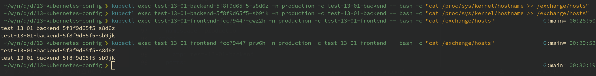

# Домашнее задание к занятию "13.2 разделы и монтирование"
Приложение запущено и работает, но время от времени появляется необходимость передавать между бекендами данные. А сам бекенд генерирует статику для фронта. Нужно оптимизировать это.
Для настройки NFS сервера можно воспользоваться следующей инструкцией (производить под пользователем на сервере, у которого есть доступ до kubectl):
* установить helm: curl https://raw.githubusercontent.com/helm/helm/master/scripts/get-helm-3 | bash
* добавить репозиторий чартов: helm repo add stable https://charts.helm.sh/stable && helm repo update
* установить nfs-server через helm: helm install nfs-server stable/nfs-server-provisioner

В конце установки будет выдан пример создания PVC для этого сервера.

## Задание 1: подключить для тестового конфига общую папку
В stage окружении часто возникает необходимость отдавать статику бекенда сразу фронтом. Проще всего сделать это через общую папку. Требования:
* в поде подключена общая папка между контейнерами (например, /static);
* после записи чего-либо в контейнере с беком файлы можно получить из контейнера с фронтом.

## Задание 2: подключить общую папку для прода
Поработав на stage, доработки нужно отправить на прод. В продуктиве у нас контейнеры крутятся в разных подах, поэтому потребуется PV и связь через PVC. Сам PV должен быть связан с NFS сервером. Требования:
* все бекенды подключаются к одному PV в режиме ReadWriteMany;
* фронтенды тоже подключаются к этому же PV с таким же режимом;
* файлы, созданные бекендом, должны быть доступны фронту.

---

# Решение

## Подготовка

1. Установил пакет `helm` для ОС Arch Linux пакетным менеджером `paru`:
    ```bash
    paru helm
    ```
1. Добавил репозиторий чартов:
    ```bash
    helm repo add stable https://charts.helm.sh/stable && helm repo update
    ```
1. Установил nfs поставщика через helm:
    ```bash
     ~/w/n/d/d/13-kubernetes-config ❯ helm install nfs-server stable/nfs-server-provisioner
    WARNING: This chart is deprecated
    NAME: nfs-server
    LAST DEPLOYED: Tue Feb 21 22:53:06 2023
    NAMESPACE: default
    STATUS: deployed
    REVISION: 1
    TEST SUITE: None
    NOTES:
    The NFS Provisioner service has now been installed.

    A storage class named 'nfs' has now been created
    and is available to provision dynamic volumes.

    You can use this storageclass by creating a `PersistentVolumeClaim` with the
    correct storageClassName attribute. For example:

        ---
        kind: PersistentVolumeClaim
        apiVersion: v1
        metadata:
          name: test-dynamic-volume-claim
        spec:
          storageClassName: "nfs"
          accessModes:
            - ReadWriteOnce
          resources:
            requests:
              storage: 100Mi
    ```

    

## Задание 1

Подготовил манифест [stage.yaml](02-mounts/manifest/stage.yml).

Для тестовой среды связь между контейнерами внутри пода осуществляется через `EmptyDir`,
который позволяет монтировать временный общий каталог.

После перезагрузки пода данные каталога удаляются.

Развернул деплой в тестовой среде:

```bash
kubectl apply -f 02-mounts/manifest/stage.yml -n stage
```


В общем каталоге создал записи из `backend`-машины и из `frontend`-машины.

На `backend`-машине проверил наличие обоих записей.

```bash
 ~/w/n/d/d/13-kubernetes-config ❯ kubectl exec test-13-01-7cf776f9db-z82rf -n stage -c test-13-01-backend -- bash -c "echo '$(date) record from backend'>/static/exchange.log"
 ~/w/n/d/d/13-kubernetes-config ❯ kubectl exec test-13-01-7cf776f9db-z82rf -n stage -c test-13-01-backend -- bash -c "cat /static/exchange.log"
Вт 21 фев 2023 23:45:23 MSK record from backend
 ~/w/n/d/d/13-kubernetes-config ❯ kubectl exec test-13-01-7cf776f9db-z82rf -n stage -c test-13-01-frontend -- bash -c "echo '$(date) record from frontend'>>/static/exchange.log"
 ~/w/n/d/d/13-kubernetes-config ❯ kubectl exec test-13-01-7cf776f9db-z82rf -n stage -c test-13-01-backend -- bash -c "cat /static/exchange.log"
Вт 21 фев 2023 23:45:23 MSK record from backend
Вт 21 фев 2023 23:46:19 MSK record from frontend
 ~/w/n/d/d/13-kubernetes-config ❯    
```


## Задание 2

Подготовил манифест [prod.yaml](02-mounts/manifest/prod.yml).

Развернул деплой в продуктовой среде:

```bash
kubectl apply -f 02-mounts/manifest/prod.yml -n production
```


Для обмена данными между подами будет использоваться `PersistentVolumeClaim` с классом хранилища `nfs`.


Для проверки общего хранилища в каталоге `/exchange` на каждой реплике `backend`-машин сделал запись с именем хоста в файле `/exchange/hosts`.

Далее на каждой реплике `frontend`-машин прочёл файл `/exchange/hosts`.

```bash
 ~/w/n/d/d/13-kubernetes-config ❯ kubectl exec test-13-01-backend-5f8f9d65f5-s8d6z -n production -c test-13-01-backend -- bash -c "cat /proc/sys/kernel/hostname >> /exchange/hosts"
 ~/w/n/d/d/13-kubernetes-config ❯ kubectl exec test-13-01-backend-5f8f9d65f5-sb9jk -n production -c test-13-01-backend -- bash -c "cat /proc/sys/kernel/hostname >> /exchange/hosts"
 ~/w/n/d/d/13-kubernetes-config ❯ kubectl exec test-13-01-frontend-fcc79447-cwz2h -n production -c test-13-01-frontend -- bash -c "cat /exchange/hosts"
test-13-01-backend-5f8f9d65f5-s8d6z
test-13-01-backend-5f8f9d65f5-sb9jk
 ~/w/n/d/d/13-kubernetes-config ❯ kubectl exec test-13-01-frontend-fcc79447-prw6h -n production -c test-13-01-frontend -- bash -c "cat /exchange/hosts"
test-13-01-backend-5f8f9d65f5-s8d6z
test-13-01-backend-5f8f9d65f5-sb9jk
 ~/w/n/d/d/13-kubernetes-config ❯   
 ```
Данные, сохранённые на `backend`-машине, доступны на `frontend`-машине.

 
