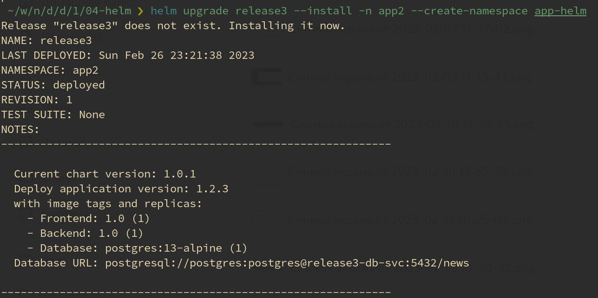

# Домашнее задание к занятию "13.4 инструменты для упрощения написания конфигурационных файлов. Helm и Jsonnet"
В работе часто приходится применять системы автоматической генерации конфигураций. Для изучения нюансов использования разных инструментов нужно попробовать упаковать приложение каждым из них.

## Задание 1: подготовить helm чарт для приложения
Необходимо упаковать приложение в чарт для деплоя в разные окружения. Требования:
* каждый компонент приложения деплоится отдельным deployment’ом/statefulset’ом;
* в переменных чарта измените образ приложения для изменения версии.

## Задание 2: запустить 2 версии в разных неймспейсах
Подготовив чарт, необходимо его проверить. Попробуйте запустить несколько копий приложения:
* одну версию в namespace=app1;
* вторую версию в том же неймспейсе;
* третью версию в namespace=app2.

## Задание 3 (*): повторить упаковку на jsonnet
Для изучения другого инструмента стоит попробовать повторить опыт упаковки из задания 1, только теперь с помощью инструмента jsonnet.

---

# Решение

## Подготовка

Кластер `Kubernetes` развёрнут при помощи `Terraform` на базе `Managed Service for Kubernetes` Yandex Cloud.

Файлы манифеста terraform расположены в каталоге [04-helm/terraform](04-helm/terraform/).

Применение манифеста осуществляется скриптом:

```ShellSession
cd 04-helm

./plan init

./plan apply
```

## Задание 1

Подготовил чарт для деплоя приложения [04-helm/app_helm/](04-helm/app_helm/).

Описание чарта [04-helm/app_helm/README.md](04-helm/app_helm/README.md).

## Задание 2

Установка приложения, упакованного в Helm, производится одной из команд:

- `helm install <релиз> <опции>`
- `helm upgrade <релиз> --install <опции>`

Запустил одну версию приложения в пространстве имён `app1` с меткой релиза `release1`:

```ShellSession
helm upgrade release1 --install -n app1 --create-namespace app-helm
```


Запустил вторую версию приложения в пространстве имён `app1` с меткой релиза `release2`:

```ShellSession
helm upgrade release2 --install -n app1 --create-namespace app-helm
```


Запустил третью версию приложения в пространстве имён `app2` с меткой релиза `release3`:

```ShellSession
helm upgrade release3 --install -n app2 --create-namespace app-helm
```



В итоге получил три версии запущенного приложения:


Выгрузил приложения:

```ShellSession
 ~/w/n/d/d/1/04-helm ❯ helm uninstall release1 -n app1
release "release1" uninstalled
 ~/w/n/d/d/1/04-helm ❯ helm uninstall release2 -n app1
release "release2" uninstalled
 ~/w/n/d/d/1/04-helm ❯ helm uninstall release3 -n app2
release "release3" uninstalled
 ~/w/n/d/d/1/04-helm ❯
```
