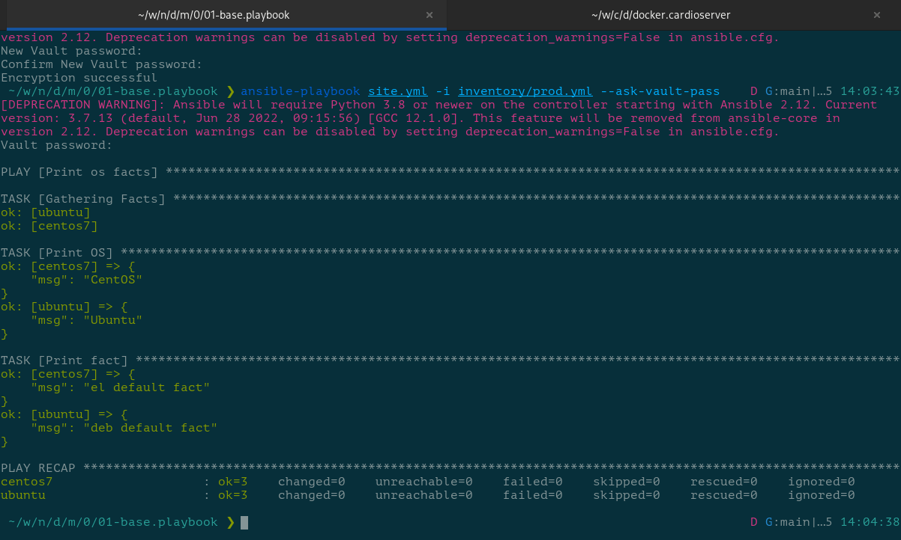

# Домашнее задание к занятию "08.01 Введение в Ansible"

## Подготовка к выполнению

1. Установите ansible версии 2.10 или выше.
2. Создайте свой собственный публичный репозиторий на github с произвольным именем.
3. Скачайте [playbook](https://github.com/netology-code/mnt-homeworks/blob/MNT-13/08-ansible-01-base/playbook) из репозитория с домашним заданием и перенесите его в свой репозиторий.


## Основная часть

> 1. Попробуйте запустить playbook на окружении из `test.yml`, зафиксируйте какое значение имеет факт `some_fact` для указанного хоста при выполнении playbook'a.

```console
 ~/w/n/d/m/0/01-base.playbook ❯ ansible-playbook site.yml -i inventory/test.yml                       G:main|…5 12:11:49
[DEPRECATION WARNING]: Ansible will require Python 3.8 or newer on the controller starting with Ansible 2.12. Current 
version: 3.7.13 (default, Jun 28 2022, 09:15:56) [GCC 12.1.0]. This feature will be removed from ansible-core in 
version 2.12. Deprecation warnings can be disabled by setting deprecation_warnings=False in ansible.cfg.

PLAY [Print os facts] **************************************************************************************************

TASK [Gathering Facts] *************************************************************************************************
[WARNING]: Platform linux on host localhost is using the discovered Python interpreter at /usr/bin/python, but future
installation of another Python interpreter could change the meaning of that path. See https://docs.ansible.com/ansible-
core/2.11/reference_appendices/interpreter_discovery.html for more information.
ok: [localhost]

TASK [Print OS] ********************************************************************************************************
ok: [localhost] => {
    "msg": "openSUSE Tumbleweed"
}

TASK [Print fact] ******************************************************************************************************
ok: [localhost] => {
    "msg": 12
}

PLAY RECAP *************************************************************************************************************
localhost                  : ok=3    changed=0    unreachable=0    failed=0    skipped=0    rescued=0    ignored=0   
```

Значение `some_fact` выводится в разделе **[Print fact]** и равно `12`.

> 2. Найдите файл с переменными (group_vars) в котором задаётся найденное в первом пункте значение и поменяйте его на 'all default fact'.
> 3. Воспользуйтесь подготовленным (используется `docker`) или создайте собственное окружение для проведения дальнейших испытаний.

Подготовлен манифест [Dockerfile](./01-base.playbook/Dockerfile.ubuntu) для образа контейнера `ubuntu`:

```dockerfile
FROM docker.io/library/ubuntu:22.04
RUN apt update && apt-get install -y python3
```

Подготовлен файл [docker-compose.yml](./01-base.playbook/docker-compose.yml) с описанием запускаемых контейнеров:

```dockerfile
version: '3'
services:
    centos7:
      image: docker.io/library/centos:7
      container_name: centos7
      command: sleep 43200

    ubuntu:
      build:
        context: .
        dockerfile: Dockerfile.ubuntu
      container_name: ubuntu
      command: sleep 43200

    fedora36:
      image: docker.io/library/fedora:36
      container_name: fedora36
      command: sleep 43200

```

> 4. Проведите запуск playbook на окружении из `prod.yml`. Зафиксируйте полученные значения `some_fact` для каждого из `managed host`.

```console
 ~/w/n/d/m/0/01-base.playbook ❯ podman ps -a
CONTAINER ID  IMAGE                                    COMMAND      CREATED        STATUS            PORTS       NAMES
ce2bccf8736d  docker.io/library/centos:7               sleep 43200  9 seconds ago  Up 9 seconds ago              centos7
fa3e597b2aab  localhost/01-baseplaybook_ubuntu:latest  sleep 43200  7 seconds ago  Up 8 seconds ago              ubuntu

 ~/w/n/d/m/0/01-base.playbook ❯ ansible-playbook site.yml -i inventory/prod.yml
[DEPRECATION WARNING]: Ansible will require Python 3.8 or newer on the controller starting with Ansible 2.12. Current 
version: 3.7.13 (default, Jun 28 2022, 09:15:56) [GCC 12.1.0]. This feature will be removed from ansible-core in 
version 2.12. Deprecation warnings can be disabled by setting deprecation_warnings=False in ansible.cfg.

PLAY [Print os facts] **************************************************************************************************

TASK [Gathering Facts] *************************************************************************************************
ok: [ubuntu]
ok: [centos7]

TASK [Print OS] ********************************************************************************************************
ok: [centos7] => {
    "msg": "CentOS"
}
ok: [ubuntu] => {
    "msg": "Ubuntu"
}

TASK [Print fact] ******************************************************************************************************
ok: [centos7] => {
    "msg": "el"
}
ok: [ubuntu] => {
    "msg": "deb"
}

PLAY RECAP *************************************************************************************************************
centos7                    : ok=3    changed=0    unreachable=0    failed=0    skipped=0    rescued=0    ignored=0   
ubuntu                     : ok=3    changed=0    unreachable=0    failed=0    skipped=0    rescued=0    ignored=0   

```

| managed host | some_fact |
| ------------ | --------- |
| centos7      | el        |
| ubuntu       | deb       |

> 5. Добавьте факты в `group_vars` каждой из групп хостов так, чтобы для `some_fact` получились следующие значения: для `deb` - 'deb default fact', для `el` - 'el default fact'.
> 6. Повторите запуск playbook на окружении `prod.yml`. Убедитесь, что выдаются корректные значения для всех хостов.


> 7. При помощи `ansible-vault` зашифруйте факты в `group_vars/deb` и `group_vars/el` с паролем `netology`.
> 8. Запустите playbook на окружении `prod.yml`. При запуске `ansible` должен запросить у вас пароль. Убедитесь в работоспособности.

Для ввода пароля при запуске плейбука необходимо указать ключ `--ask-vault-pass`:



> 9. Посмотрите при помощи `ansible-doc` список плагинов для подключения. Выберите подходящий для работы на `control node`.

Просмотреть список доступных плагинов подключения можно командой `ansible-doc -t connection --list`:

```console
 ~/w/n/d/m/0/01-base.playbook ❯ ansible-doc -t connection --list                                    D G:main|…5 14:52:31
[DEPRECATION WARNING]: Ansible will require Python 3.8 or newer on the controller starting with Ansible 2.12. Current 
version: 3.7.13 (default, Jun 28 2022, 09:15:56) [GCC 12.1.0]. This feature will be removed from ansible-core in 
version 2.12. Deprecation warnings can be disabled by setting deprecation_warnings=False in ansible.cfg.
[WARNING]: Collection splunk.es does not support Ansible version 2.11.12
[WARNING]: Collection ibm.qradar does not support Ansible version 2.11.12
[WARNING]: Collection frr.frr does not support Ansible version 2.11.12
ansible.netcommon.httpapi      Use httpapi to run command on network appliances                                    
ansible.netcommon.libssh       (Tech preview) Run tasks using libssh for ssh connection                            
ansible.netcommon.napalm       Provides persistent connection using NAPALM                                         
ansible.netcommon.netconf      Provides a persistent connection using the netconf protocol                         
ansible.netcommon.network_cli  Use network_cli to run command on network appliances                                
ansible.netcommon.persistent   Use a persistent unix socket for connection                                         
community.aws.aws_ssm          execute via AWS Systems Manager                                                     
community.docker.docker        Run tasks in docker containers                                                      
community.docker.docker_api    Run tasks in docker containers                                                      
community.docker.nsenter       execute on host running controller container                                        
community.general.chroot       Interact with local chroot                                                          
community.general.funcd        Use funcd to connect to target                                                      
community.general.iocage       Run tasks in iocage jails                                                           
community.general.jail         Run tasks in jails                                                                  
community.general.lxc          Run tasks in lxc containers via lxc python library                                  
community.general.lxd          Run tasks in lxc containers via lxc CLI                                             
community.general.qubes        Interact with an existing QubesOS AppVM                                             
community.general.saltstack    Allow ansible to piggyback on salt minions                                          
community.general.zone         Run tasks in a zone instance                                                        
community.kubernetes.kubectl   Execute tasks in pods running on Kubernetes                                         
community.libvirt.libvirt_lxc  Run tasks in lxc containers via libvirt                                             
community.libvirt.libvirt_qemu Run tasks on libvirt/qemu virtual machines                                          
community.okd.oc               Execute tasks in pods running on OpenShift                                          
community.vmware.vmware_tools  Execute tasks inside a VM via VMware Tools                                          
containers.podman.buildah      Interact with an existing buildah container                                         
containers.podman.podman       Interact with an existing podman container                                          
kubernetes.core.kubectl        Execute tasks in pods running on Kubernetes                                         
local                          execute on controller                                                               
paramiko_ssh                   Run tasks via python ssh (paramiko)                                                 
psrp                           Run tasks over Microsoft PowerShell Remoting Protocol                               
ssh                            connect via ssh client binary                                                       
winrm                          Run tasks over Microsoft's WinRM                
```

> 10. В `prod.yml` добавьте новую группу хостов с именем  `local`, в ней разместите localhost с необходимым типом подключения.

```yaml
---
  el:
    hosts:
      centos7:
        ansible_connection: community.docker.docker
  deb:
    hosts:
      ubuntu:
        ansible_connection: containers.podman.podman
  local:
    hosts:
      localhost:
        ansible_connection: local
```

> 11. Запустите playbook на окружении `prod.yml`. При запуске `ansible` должен запросить у вас пароль. Убедитесь что факты `some_fact` для каждого из хостов определены из верных `group_vars`.

```console
~/w/n/d/m/0/01-base.playbook ❯ ansible-playbook site.yml -i inventory/prod.yml --ask-vault-pass
[DEPRECATION WARNING]: Ansible will require Python 3.8 or newer on the controller starting with Ansible 2.12. Current 
version: 3.7.13 (default, Jun 28 2022, 09:15:56) [GCC 12.1.0]. This feature will be removed from ansible-core in 
version 2.12. Deprecation warnings can be disabled by setting deprecation_warnings=False in ansible.cfg.
Vault password: 

PLAY [Print os facts] **************************************************************************************************

TASK [Gathering Facts] *************************************************************************************************
[WARNING]: Platform linux on host localhost is using the discovered Python interpreter at /usr/bin/python, but future
installation of another Python interpreter could change the meaning of that path. See https://docs.ansible.com/ansible-
core/2.11/reference_appendices/interpreter_discovery.html for more information.
ok: [localhost]
ok: [centos7]
ok: [ubuntu]

TASK [Print OS] ********************************************************************************************************
ok: [localhost] => {
    "msg": "openSUSE Tumbleweed"
}
ok: [centos7] => {
    "msg": "CentOS"
}
ok: [ubuntu] => {
    "msg": "Ubuntu"
}

TASK [Print fact] ******************************************************************************************************
ok: [localhost] => {
    "msg": "all default fact"
}
ok: [centos7] => {
    "msg": "el default fact"
}
ok: [ubuntu] => {
    "msg": "deb default fact"
}

PLAY RECAP *************************************************************************************************************
centos7                    : ok=3    changed=0    unreachable=0    failed=0    skipped=0    rescued=0    ignored=0   
localhost                  : ok=3    changed=0    unreachable=0    failed=0    skipped=0    rescued=0    ignored=0   
ubuntu                     : ok=3    changed=0    unreachable=0    failed=0    skipped=0    rescued=0    ignored=0   
```

> 12. Заполните `README.md` ответами на вопросы. Сделайте `git push` в ветку `master`. В ответе отправьте ссылку на ваш открытый репозиторий с изменённым `playbook` и заполненным `README.md`.

## Необязательная часть

> 1. При помощи `ansible-vault` расшифруйте все зашифрованные файлы с переменными.
> 2. Зашифруйте отдельное значение `PaSSw0rd` для переменной `some_fact` паролем `netology`. Добавьте полученное значение в `group_vars/all/exmp.yml`.
> 3. Запустите `playbook`, убедитесь, что для нужных хостов применился новый `fact`.


> 4. Добавьте новую группу хостов `fedora`, самостоятельно придумайте для неё переменную. В качестве образа можно использовать [этот](https://hub.docker.com/r/pycontribs/fedora).

[inventory/fedora.yml](./01-base.playbook/inventory/fedora.yml):

```yaml
---
  fedora:
    hosts:
      fedora36:
        ansible_connection: containers.podman.podman
```

[group_vars/fedora/examp.yml](./01-base.playbook/group_vars/fedora/examp.yml):

```yaml
---
  host_info: " - Fedora project"
```

[site.yml](./01-base.playbook/site.yml):

```yaml
---
  - name: Print os facts
    hosts: all
    # remote_user: micard
    tasks:
      - name: Print OS
        debug:
          msg: "{{ ansible_distribution }}"
      - name: Print fact
        debug:
          msg: "{{ some_fact }}{{ host_info }}"
```

> 5. Напишите скрипт на bash: автоматизируйте поднятие необходимых контейнеров, запуск ansible-playbook и остановку контейнеров.

[Скрипт](./01-base.playbook/exec.sh):

```bash
#!/usr/bun/env bash
docker run -d --rm --name fedora36 docker.io/library/fedora:36 sleep 43200
echo "netology" > pass.tmp
ansible-playbook site.yml -i inventory/fedora.yml --vault-password-file pass.tmp
rm -f pass.tmp
docker stop fedora36
echo -e "\033[37mHave a nice day!\033[m"
```


> 6. Все изменения должны быть зафиксированы и отправлены в вашей личный репозиторий.
