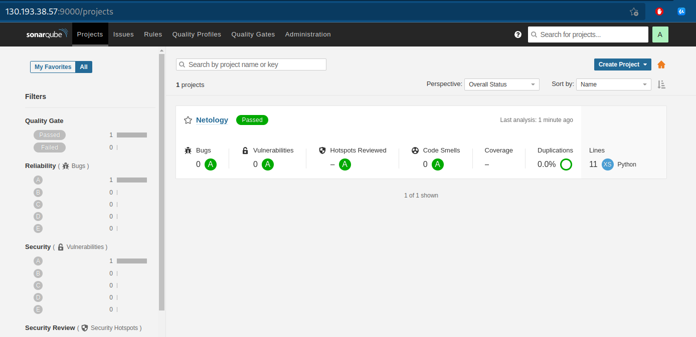

# Домашнее задание к занятию "09.03 CI\CD"

## Подготовка к выполнению

1. Создаём 2 VM в yandex cloud со следующими параметрами: 2CPU 4RAM Centos7(остальное по минимальным требованиям)
2. Прописываем в [inventory](./infrastructure/inventory/cicd/hosts.yml) [playbook'a](./infrastructure/site.yml) созданные хосты
3. Добавляем в [files](./infrastructure/files/) файл со своим публичным ключом (id_rsa.pub). Если ключ называется иначе - найдите таску в плейбуке, которая использует id_rsa.pub имя и исправьте на своё
4. Запускаем playbook, ожидаем успешного завершения
5. Проверяем готовность Sonarqube через [браузер](http://localhost:9000)
6. Заходим под admin\admin, меняем пароль на свой
7.  Проверяем готовность Nexus через [бразуер](http://localhost:8081)
8. Подключаемся под admin\admin123, меняем пароль, сохраняем анонимный доступ

## Знакомоство с SonarQube

### Основная часть

1. Создаём новый проект, название произвольное
2. Скачиваем пакет sonar-scanner, который нам предлагает скачать сам sonarqube
3. Делаем так, чтобы binary был доступен через вызов в shell (или меняем переменную PATH или любой другой удобный вам способ)
4. Проверяем `sonar-scanner --version`
5. Запускаем анализатор против кода из директории [example](./example) с дополнительным ключом `-Dsonar.coverage.exclusions=fail.py`
6. Смотрим результат в интерфейсе
7. Исправляем ошибки, которые он выявил(включая warnings)
8. Запускаем анализатор повторно - проверяем, что QG пройдены успешно
9. Делаем скриншот успешного прохождения анализа, прикладываем к решению ДЗ

## Знакомство с Nexus

### Основная часть

1. В репозиторий `maven-releases` загружаем артефакт с GAV параметрами:
   1. groupId: netology
   2. artifactId: java
   3. version: 8_282
   4. classifier: distrib
   5. type: tar.gz
2. В него же загружаем такой же артефакт, но с version: 8_102
3. Проверяем, что все файлы загрузились успешно
4. В ответе присылаем файл `maven-metadata.xml` для этого артефекта

### Знакомство с Maven

### Подготовка к выполнению

1. Скачиваем дистрибутив с [maven](https://maven.apache.org/download.cgi)
2. Разархивируем, делаем так, чтобы binary был доступен через вызов в shell (или меняем переменную PATH или любой другой удобный вам способ)
3. Удаляем из `apache-maven-<version>/conf/settings.xml` упоминание о правиле, отвергающем http соединение( раздел mirrors->id: my-repository-http-blocker)
4. Проверяем `mvn --version`
5. Забираем директорию [mvn](./mvn) с pom

### Основная часть

1. Меняем в `pom.xml` блок с зависимостями под наш артефакт из первого пункта задания для Nexus (java с версией 8_282)
2. Запускаем команду `mvn package` в директории с `pom.xml`, ожидаем успешного окончания
3. Проверяем директорию `~/.m2/repository/`, находим наш артефакт
4. В ответе присылаем исправленный файл `pom.xml`

---

### Как оформить ДЗ?

Выполненное домашнее задание пришлите ссылкой на .md-файл в вашем репозитории.

---

## Реализация

1. Инициализация инфраструктуры:

   ```bash
   cd infrastrucrute
   ansible-playbook infra.yml
   ```

1. Конфигурация инфраструктуры:

   ```bash
   ansible-playbook site.yml -i inventory/cicd/hosts.yml
   ```

1. Через браузер подключился к только что сконфигурированным сервисам **sonarqube** и **Sonatype Nexus Repository Manager** и сменил пароли доступа.

1. В контейнере запустил sonar-scaner:

   ```bash
   ~/w/n/d/m/0/03-cicd ❯ docker run \
                              --rm \
                              sonarsource/sonar-scanner-cli sonar-scanner --version
   INFO: Scanner configuration file: /opt/sonar-scanner/conf/sonar-scanner.properties
   INFO: Project root configuration file: NONE
   INFO: SonarScanner 4.7.0.2747
   INFO: Java 11.0.15 Alpine (64-bit)
   INFO: Linux 5.19.2-1-vanilla amd64
   ```

1. Запустил проверку исходного кода из каталога `./example/`:

   ```bash
   ~/w/n/d/m/0/0/example ❯ docker run \
                                    --rm \
                                    -v "$(pwd):/usr/src" \
                                    sonarsource/sonar-scanner-cli sonar-scanner \
                                    -Dsonar.projectKey=Netology \
                                    -Dsonar.coverage.exclusions=fail.py \
                                    -Dsonar.host.url=http://130.193.38.57:9000 \
                                    -Dsonar.login=97a70d05ce24b644b4408212b1f1621f253c101b
   ```

1. Полученные предупреждения исправлены в исходном коде и после повторного запуска получен положительный результат:

   

1. В репозитории `maven-release` **Nexus** (через браузер) загружено две версии артификта. Файл `maven-metadata.xml`:

   ```xml
   <?xml version="1.0" encoding="UTF-8"?>
   <metadata modelVersion="1.1.0">
   <groupId>netology</groupId>
   <artifactId>java</artifactId>
   <versioning>
      <latest>8_282</latest>
      <release>8_282</release>
      <versions>
         <version>8_102</version>
         <version>8_282</version>
      </versions>
      <lastUpdated>20220902093420</lastUpdated>
   </versioning>
   </metadata>
   ```

1. В контейнере запустил **Maven**:

   ```bash
   ~/w/n/d/m/0/0/example ❯ docker run -it --rm --name my-maven-project -v "$(pwd)":/usr/src/mymaven -w /usr/src/mymaven maven:3.3-jdk-8 mvn --version
   Apache Maven 3.3.9 (bb52d8502b132ec0a5a3f4c09453c07478323dc5; 2015-11-10T16:41:47+00:00)
   Maven home: /usr/share/maven
   Java version: 1.8.0_121, vendor: Oracle Corporation
   Java home: /usr/lib/jvm/java-8-openjdk-amd64/jre
   Default locale: en, platform encoding: UTF-8
   OS name: "linux", version: "5.19.2-1-vanilla", arch: "amd64", family: "unix"
   ```

1. Изменил файл [pom.xml](./03-cicd/mvn/pom.xml), добавил зависимости:

   ```xml
   <project xmlns="http://maven.apache.org/POM/4.0.0" xmlns:xsi="http://www.w3.org/2001/XMLSchema-instance"
   xsi:schemaLocation="http://maven.apache.org/POM/4.0.0 http://maven.apache.org/xsd/maven-4.0.0.xsd">
   <modelVersion>4.0.0</modelVersion>

   <groupId>netology</groupId>
   <artifactId>java</artifactId>
   <version>8_282</version>
      <repositories>
      <repository>
         <id>my-rep</id>
         <name>maven-public</name>
         <url>http://130.193.36.226:8081/repository/maven-releases/</url>
      </repository>
   </repositories>
   <dependencies>
      <dependency>
         <groupId>netology</groupId>
         <artifactId>java</artifactId>
         <version>8_282</version>
         <classifier>distrib</classifier>
         <type>tar.gz</type>
      </dependency>
   </dependencies>
   </project>
   ```

1. Запустил процесс сборки maven-проекта:

   ```bash
   ~/w/n/d/m/0/0/mvn ❯ docker run -it --rm --name my-maven-project -v "$(pwd)":/usr/src/mymaven -v "$(pwd)/repository":/root/.m2/repository -w /usr/src/mymaven maven:3.3-jdk-8 mvn package
   ```

1. Убедился в получении зависимостей из `Nexus`:

   ```bash
   ~/w/n/d/m/0/0/mvn ❯ l repository/netology/java/8_282/
   итого 12K
   -rw-r--r-- 1 shtepa shtepa 348 сен  2 16:10 java-8_282-distrib.tar.gz
   -rw-r--r-- 1 shtepa shtepa  40 сен  2 16:10 java-8_282-distrib.tar.gz.sha1
   -rw-r--r-- 1 shtepa shtepa 167 сен  2 16:10 _remote.repositories
   ```
