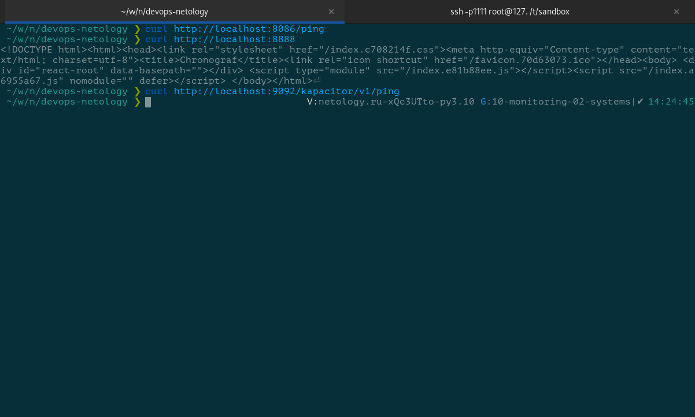
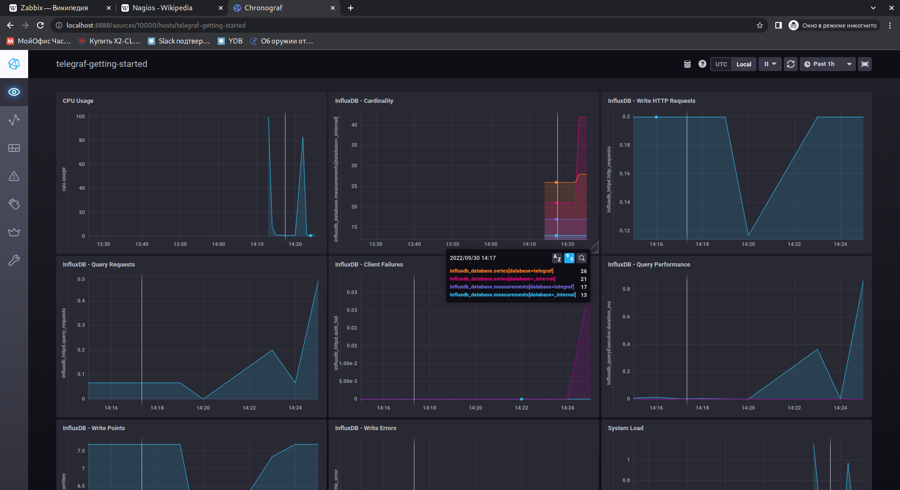
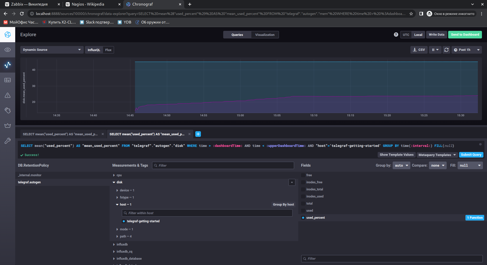
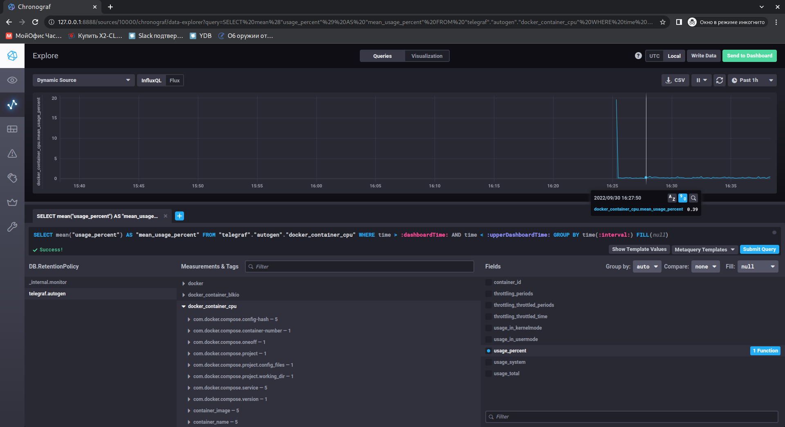

# Домашнее задание к занятию "10.02. Системы мониторинга"

## Обязательные задания

### 1. Опишите основные плюсы и минусы pull и push систем мониторинга.

  ---

  Любая система мониторирования состоит из агента, регистрирующего метрики, сборщика и визуализатора собранных метрик, а так же модуля оповещения.

В системах номиторирования может быть использовано две модели сбора метрик, отличающихся инициатором передачи данных.

---

**PUSH**: агент регистрирует метрики и либо сразу передаёт в сборщик, либо по расписанию. Сборщик работает на приём метрик, агент выступает инициатором отправки.
  
  &#128077; можно настроить объём регистрируемых данных и периодичность их отправки в систему мониторирования;

  &#128077; метрики можно передавать одновременно в несколько систем мониторирования (например, для резервирования);

  &#128077; есть мозможность передать метрики при краткосрочных сеансах связи с основной системой мониторирования (например, спутниковая связь);

  &#128077; возможно использовать протокол UDP, то есть эффективно передавать данные без подтверждения их приёма адресатом;

  &#128077; возможно передавать метрики в случае блокировки входящих сетевых соединений на хосте;

  &#128078; необходимо настраивать каждый агент, подстраиваться по конкретный набор метрик хоста;

  &#128078; при использовании протокола UDP нет гарантий доставки метрик в систему мониторирования, а значит реакция на инцидент может быть запоздалой.

---

**PULL**: агент регистрирует метрики и отдаёт их сборщику только по запросу. Переодичность запроса метрик определяется сборщиком. Агент может накапливать некоторое значение метрик локально.

  &#128077; нет необходимости настраивать каждый агент, контролируемые метрики определяются сборщиком;

  &#128077; гарантия подлинности данных - метрики запрашиваются только у известных агентов;

  &#128077; как правило используется протокол HTTP, который легче маршрутизируется (проксируется), а так же его можно обернуть в TLS повысив его защищённость;

  &#128077; используя защищённый канал связи можно разнести по разным сетям агенты и сборщика, сделать систему мониторирования распределённой;

  &#128077; возможна разработка и отладка собственных агентов или, наоборот, разработка и отладка сборщиков;

  &#128078; более высокие требование к каналу связи и производительности хостов.

---

### 2. Какие из ниже перечисленных систем относятся к push модели, а какие к pull? А может есть гибридные?

  - **Prometheus** - собирает метрики в соответствии с **pull**-моделью. Prometheus Server запрашивает метрики у Jobs/Exporters (Prometheus targets). В некоторых случаях в качестве Prometheus target может выступать Pushgateway, который в сою очередь может собирать метрики с короткоживущих задач в соответствии с **push**-моделью.
  - **TICK** - система мониторинга представляющая собой набор программ (Telegraf, InfluxDB, Chronograf и Kapacitor). Telegraf регистрирует метрики и отправляет в базу данных временых рядов InfluxDB. Chronograf позволяет отобразить метрики, а Kapacitor работает как модуль оповещения. Следовательно TICK работает в соответствии с **push**-моделью. При этом Telegraf можно использовать в связке с другим программным обеспечением по **pull**-модели, настроив Telegraf на сохранение метрик локально, а другое ПО будет отдавать сохранённые локально метрики.
  - **Zabbix** - коробочное решение системы мониторирования, относится к гибридным системам. Использует активные проверки метрик в соответствии с **push**-моделью и пассивные проверки метрик в соответствии с **pull**-моделью.
  - **VictoriaMetrics** - высокопроизводительная база данных временных рядов для систем мониторирования, разработанная с оглядкой на популярные промышленные решения. VictoriaMetrics поддерживает такие протоколы и форматы как `Prometheus remote_write API`, `DataDog submit metrics API`, `InfluxDB line protocol`, `Graphite plaintext protocol`, `OpenTSDB http /api/put protocol` и многие другие. Из выше сказанного следует что система мониторирования, построенная на базе VictoriaMetrics гибридное, может работать как по **push**-модели, так и по **pull**-модели.
  - **Nagios** - система мониторирования основанная на протоколах `NRDP`, `NSClient++` и `NCPA`. Перечисленные протоколы предполагают работу агентов в пассивном режиме, то есть они аккумулируют значения метрик локально и выдают их по запросу от сборщика, что соответствует **pull**-модели.

### 3. Склонируйте себе [репозиторий](https://github.com/influxdata/sandbox/tree/master) и запустите TICK-стэк, используя технологии docker и docker-compose.

В виде решения на это упражнение приведите выводы команд с вашего компьютера (виртуальной машины):

    - curl http://localhost:8086/ping
    - curl http://localhost:8888
    - curl http://localhost:9092/kapacitor/v1/ping

  

А также скриншот веб-интерфейса ПО chronograf (`http://localhost:8888`). 

  

P.S.: если при запуске некоторые контейнеры будут падать с ошибкой - проставьте им режим `Z`, например
`./data:/var/lib:Z`

### 4. Перейдите в веб-интерфейс Chronograf (`http://localhost:8888`) и откройте вкладку `Data explorer`.

  - Нажмите на кнопку `Add a query`
  - Изучите вывод интерфейса и выберите БД `telegraf.autogen`
  - В `measurments` выберите mem->host->telegraf_container_id , а в `fields` выберите used_percent. 
    Внизу появится график утилизации оперативной памяти в контейнере telegraf.
  - Вверху вы можете увидеть запрос, аналогичный SQL-синтаксису. 
    Поэкспериментируйте с запросом, попробуйте изменить группировку и интервал наблюдений.

Для выполнения задания приведите скриншот с отображением метрик утилизации места на диске 
(disk->host->telegraf_container_id) из веб-интерфейса.

---

Для выполнения задания включил в конфигурационном файле [telegraf.conf](./02-systems/telegraf.conf) плагины `inputs.mem` и `inputs.disk`:

<details>
<summary>Конфигурационный файл</summary>

```conf
[agent]
  interval = "5s"
  round_interval = true
  metric_batch_size = 1000
  metric_buffer_limit = 10000
  collection_jitter = "0s"
  flush_interval = "5s"
  flush_jitter = "0s"
  precision = ""
  debug = false
  quiet = false
  logfile = ""
  hostname = "$HOSTNAME"
  omit_hostname = false

[[outputs.influxdb]]
  urls = ["http://influxdb:8086"]
  database = "telegraf"
  username = ""
  password = ""
  retention_policy = ""
  write_consistency = "any"
  timeout = "5s"

[[inputs.docker]]
  endpoint = "unix:///var/run/docker.sock"
  container_names = []
  timeout = "5s"
  perdevice = true
  total = false
[[inputs.cpu]]
[[inputs.system]]
[[inputs.influxdb]]
  urls = ["http://influxdb:8086/debug/vars"]
[[inputs.syslog]]
#   ## Specify an ip or hostname with port - eg., tcp://localhost:6514, tcp://10.0.0.1:6514
#   ## Protocol, address and port to host the syslog receiver.
#   ## If no host is specified, then localhost is used.
#   ## If no port is specified, 6514 is used (RFC5425#section-4.1).
  server = "tcp://localhost:6514"
[[inputs.mem]]
[[inputs.disk]]
  ignore_fs = ["tmpfs", "devtmpfs", "devfs", "iso9660", "overlay", "aufs", "squashfs"]  

```

</details>



---

### 5. Изучите список [telegraf inputs](https://github.com/influxdata/telegraf/tree/master/plugins/inputs). 
Добавьте в конфигурацию telegraf следующий плагин - [docker](https://github.com/influxdata/telegraf/tree/master/plugins/inputs/docker):
```
[[inputs.docker]]
  endpoint = "unix:///var/run/docker.sock"
```

Дополнительно вам может потребоваться донастройка контейнера telegraf в `docker-compose.yml` дополнительного volume и 
режима privileged:
```
  telegraf:
    image: telegraf:1.4.0
    privileged: true
    volumes:
      - ./etc/telegraf.conf:/etc/telegraf/telegraf.conf:Z
      - /var/run/docker.sock:/var/run/docker.sock:Z
    links:
      - influxdb
    ports:
      - "8092:8092/udp"
      - "8094:8094"
      - "8125:8125/udp"
```

После настройке перезапустите telegraf, обновите веб интерфейс и приведите скриншотом список `measurments` в 
веб-интерфейсе базы telegraf.autogen . Там должны появиться метрики, связанные с docker.

Факультативно можете изучить какие метрики собирает telegraf после выполнения данного задания.

---

Для выполнения задания необходимо было добавить в docker-compose.yml  проекта sandbox пользователя `telegraf:docker` для контейнера `telegraf`:

```docker
...
  telegraf:
    # Full tag list: https://hub.docker.com/r/library/telegraf/tags/
    build:
      context: ./images/telegraf/
      dockerfile: ./${TYPE}/Dockerfile
      args:
        TELEGRAF_TAG: ${TELEGRAF_TAG}
    image: "telegraf"
    user: telegraf:998
    environment:
      HOSTNAME: "telegraf-getting-started"
    # Telegraf requires network access to InfluxDB
    links:
      - influxdb
    volumes:
      # Mount for telegraf configuration
      - ./telegraf/:/etc/telegraf/
      # Mount for Docker API access
      - /var/run/docker.sock:/var/run/docker.sock
    depends_on:
      - influxdb
...
```



---

## Дополнительное задание (со звездочкой*) - необязательно к выполнению

В веб-интерфейсе откройте вкладку `Dashboards`. Попробуйте создать свой dashboard с отображением:

    - утилизации ЦПУ
    - количества использованного RAM
    - утилизации пространства на дисках
    - количество поднятых контейнеров
    - аптайм
    - ...
    - фантазируйте)
    
    ---


