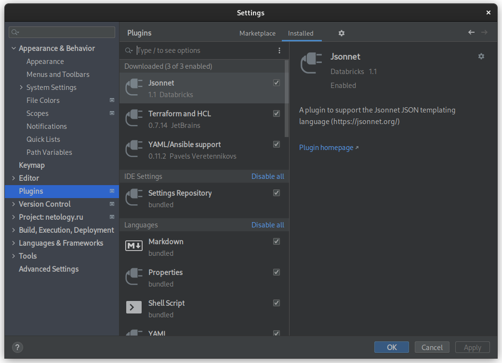
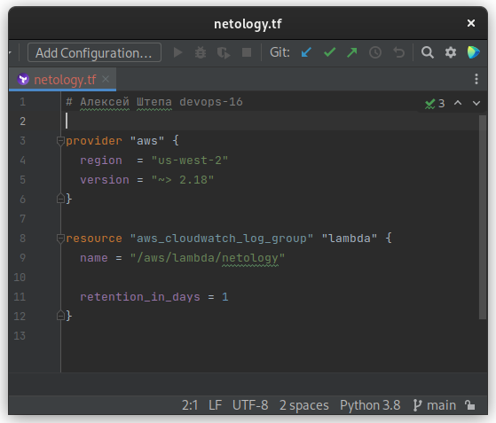
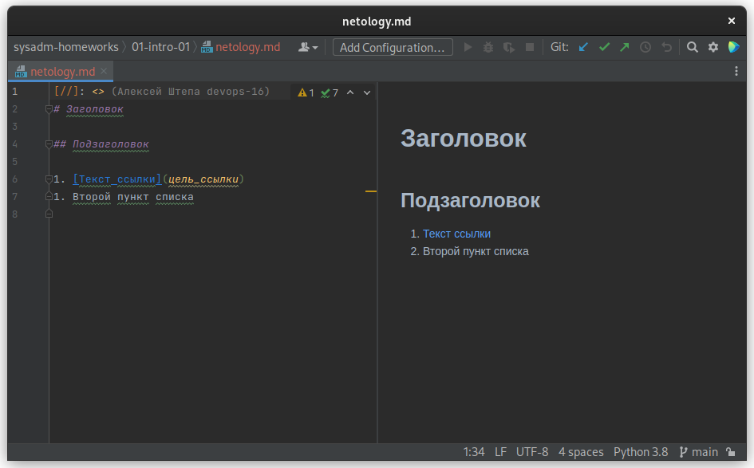
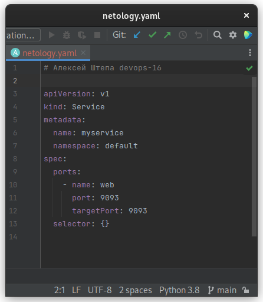
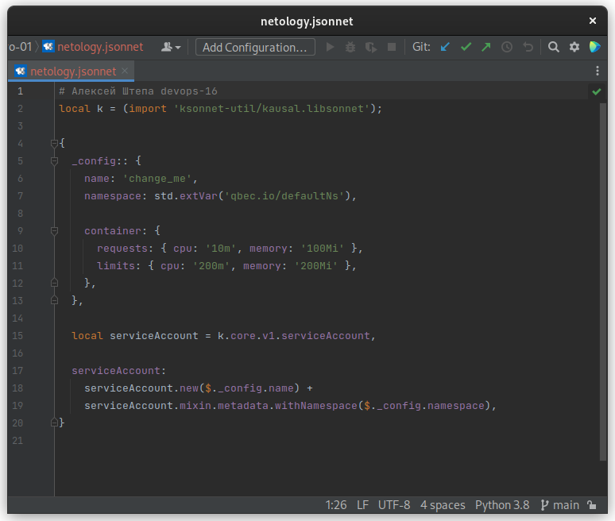
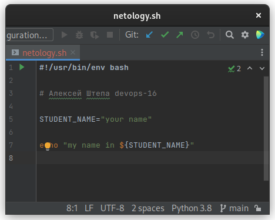

# Домашнее задание к занятию «1.1. Введение в DevOps»

## Задание №1 - Подготовка рабочей среды

1. Установлена интегрированная среда разработки [JetBrains PyCharm Community Edition](https://www.jetbrains.com/ru-ru/pycharm/download/)
2. Установлены плагины:
    - Terraform,
    - MarkDown,
    - Yaml/Ansible Support,
    - Jsonnet.

3. В сервисе **GitHub** зарегистрировал публичный [репозиторий](https://github.com/aleksei-shtepa/netology.ru/tree/main/sysadm-homeworks/01-intro-01).
4. В репозитории сформировал файлы:
    - [Terraform](netology.tf)  

    - [MarkDown](netology.md)  

    - [Yaml/Ansible Support](netology.yaml)  

    - [Jsonnet](netology.jsonnet)  

    - [Bash](netology.sh)  

## Задание №2 - Описание жизненного цикла задачи (разработки нового функционала)

### Процесс решения задачи (реализации новой функциональности)

1. Формирование задачи, согласование её конечной реализации между клиентом и менеджером.
2. Согласование варианта реализации задачи между разработчиками, тестировщиками и DevOps. Учёт внешних интеграций,
влияния новой задачи на реализованные ранее.
3. DevOps готовит инфраструктуру для решения задачи разработчиками и тестировщиками.
4. Разработчики реализуют задачу, покрывают новый код тестами.
5. DevOps обеспечивает процесс автоматического тестирования, формирования изолированного окружения для тестирования
задачи и передачу окружения команде тестировщиков. Если автоматические тесты не проходят, то задача возвращается
разработчикам.
6. Тестировщики проверяют корректность решения задачи. Если решение не корректно, то задача возвращается разработчикам.
7. Протестированное решение задачи демонстрируется менеджеру, возможно клиенту.
8. Протестированное и согласованное решение задачи вливается в основной код. Отклонённое решение возвращается на
доработку.
