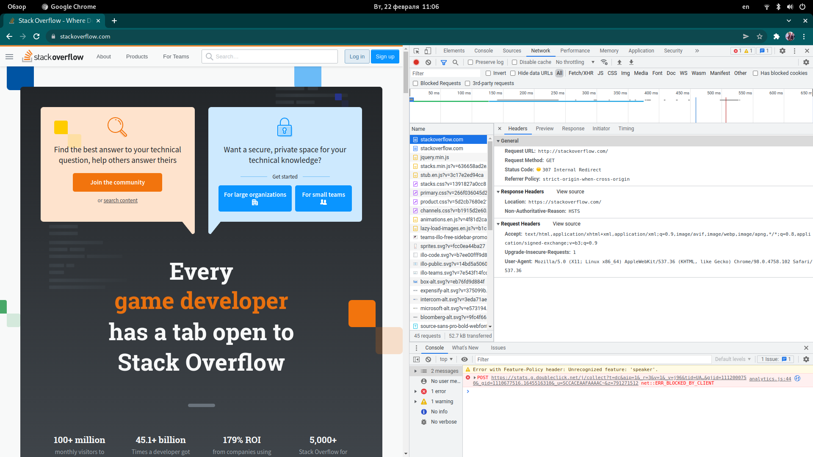
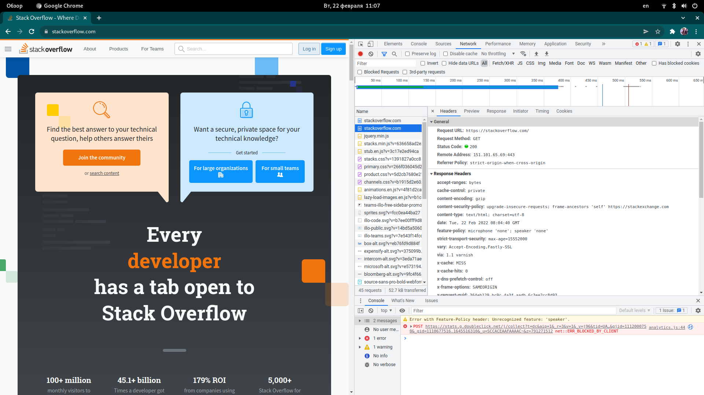
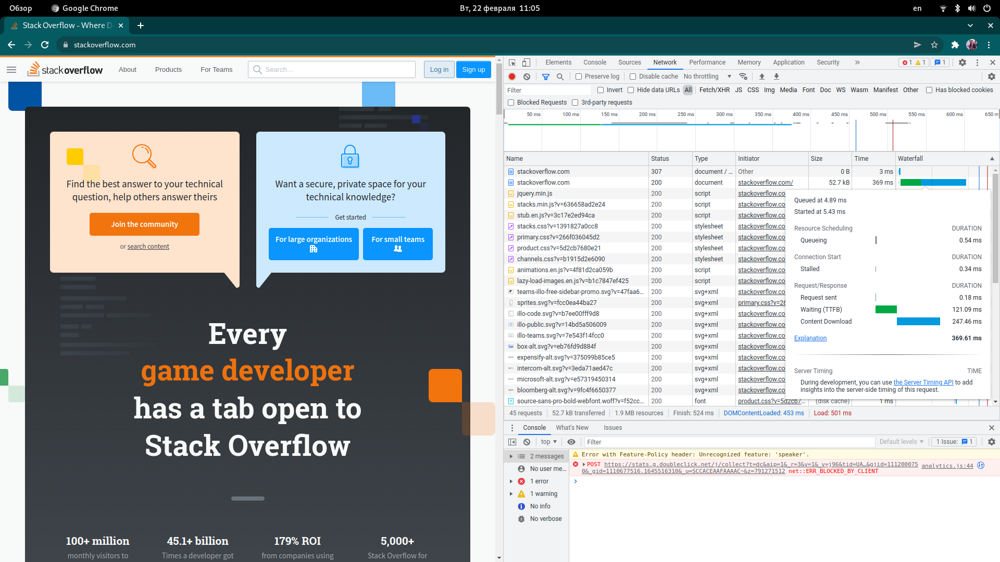
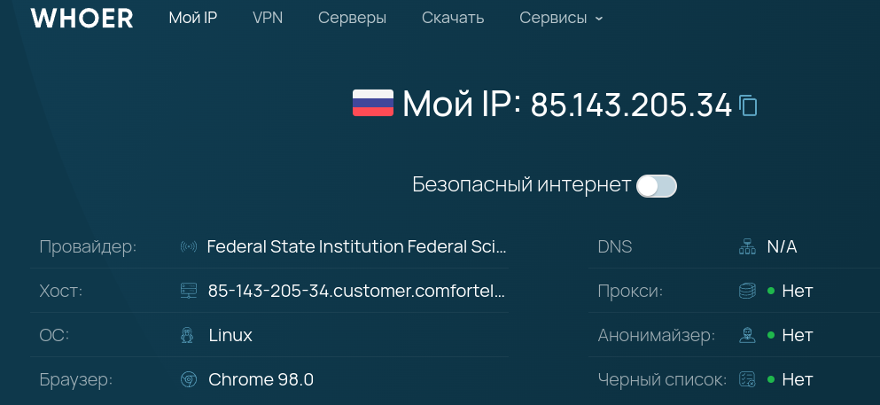

# Домашнее задание к занятию "3.6. Компьютерные сети, лекция 1"

1. Работа c HTTP через телнет.
- Подключитесь утилитой телнет к сайту stackoverflow.com
`telnet stackoverflow.com 80`
- отправьте HTTP запрос
```bash
GET /questions HTTP/1.0
HOST: stackoverflow.com
[press enter]
[press enter]
```
- В ответе укажите полученный HTTP код, что он означает?

    ---

    ```bash
    vagrant@vagrant:~$ telnet stackoverflow.com 80
    Trying 151.101.65.69...
    Connected to stackoverflow.com.
    Escape character is '^]'.
    GET /questions HTTP/1.0
    HOST: stackoverflow.com

    HTTP/1.1 301 Moved Permanently
    cache-control: no-cache, no-store, must-revalidate
    location: https://stackoverflow.com/questions
    x-request-guid: ac0d7b5e-49d3-444b-be02-10988a85dd0b
    feature-policy: microphone 'none'; speaker 'none'
    content-security-policy: upgrade-insecure-requests; frame-ancestors 'self' https://stackexchange.com
    Accept-Ranges: bytes
    Date: Tue, 22 Feb 2022 07:33:16 GMT
    Via: 1.1 varnish
    Connection: close
    X-Served-By: cache-hhn4052-HHN
    X-Cache: MISS
    X-Cache-Hits: 0
    X-Timer: S1645515196.137061,VS0,VE85
    Vary: Fastly-SSL
    X-DNS-Prefetch-Control: off
    Set-Cookie: prov=d8ce0b5c-adb6-e54c-5712-3f5d13acd4da; domain=.stackoverflow.com; expires=Fri, 01-Jan-2055 00:00:00 GMT; path=/; HttpOnly

    Connection closed by foreign host.
    vagrant@vagrant:~
    ```

    * В ответ получен код **301** (Moved Permanently). Код означает, что запрашиваемая нами страница перемещёна на постоянной основе на другой URL. В поле `location` указывается новый URL.

    * По сути, web-сервер сообщает нам, что запрашиваемая страница доступна только по протоколу **HTTPS**.
    ---

2. Повторите задание 1 в браузере, используя консоль разработчика F12.
- откройте вкладку `Network`
- отправьте запрос http://stackoverflow.com
- найдите первый ответ HTTP сервера, откройте вкладку `Headers`
- укажите в ответе полученный HTTP код.
- проверьте время загрузки страницы, какой запрос обрабатывался дольше всего?
- приложите скриншот консоли браузера в ответ.

    ---

    * В браузере получен ответ сервера **307** (Temporary Redirect, хотя браузер **Chrome** называет этот код как Internal Redirect).

        [02_307.png](images/02_307.png):

        

    * После перенаправления на HTTPS получен код 200  

        [03_200.png](images/03_200.png):

        

    * Дольше всего выполнялся запрос `https://stackoverflow.com`, загрузка его контента.

        [01_timing.png](images/01_timing.png):

        


    ---

3. Какой IP адрес у вас в интернете?

    

4. Какому провайдеру принадлежит ваш IP адрес? Какой автономной системе AS? Воспользуйтесь утилитой `whois`

    * IP принадлежит "**Comfortel Ltd**.". Автономная система - **AS56534**.

        ```bash
        vagrant@vagrant:~$ whois 85.143.205.34
        % This is the RIPE Database query service.
        % The objects are in RPSL format.
        %
        % The RIPE Database is subject to Terms and Conditions.
        % See http://www.ripe.net/db/support/db-terms-conditions.pdf

        % Note: this output has been filtered.
        %       To receive output for a database update, use the "-B" flag.

        % Information related to '85.143.204.0 - 85.143.207.255'

        % Abuse contact for '85.143.204.0 - 85.143.207.255' is 'abuse@comfortel.pro'

        inetnum:        85.143.204.0 - 85.143.207.255
        netname:        COMforTEL
        descr:          PIRIX customers networks
        descr:          Bolshoy Sampsonievskiy prospekt 106A
        descr:          194156,  St.Petersburg
        country:        RU
        org:            ORG-CL253-RIPE
        admin-c:        PIRX-RIPE
        tech-c:         PIRX-RIPE
        tech-c:         RUN-RIPE
        status:         ASSIGNED PA
        mnt-by:         RUNNET-MNT
        created:        2016-03-29T19:30:36Z
        last-modified:  2016-03-29T19:30:36Z
        source:         RIPE # Filtered

        organisation:   ORG-CL253-RIPE
        org-name:       Comfortel Ltd.
        country:        RU
        org-type:       LIR
        address:        Detskiy str 5 office 304
        address:        196084
        address:        Saint-Petersburg
        address:        RUSSIAN FEDERATION
        phone:          +78126700000
        fax-no:         +78126700000 ext. 4
        admin-c:        CMFT
        tech-c:         CMFT
        abuse-c:        CMFT
        mnt-ref:        RIPE-NCC-HM-MNT
        mnt-ref:        CMFT-MNT
        mnt-ref:        CMFT-MNT
        mnt-ref:        MNT-PINSUPPORT
        mnt-ref:        ru-extatic-1-mnt
        mnt-ref:        QWARTA-MNT
        mnt-ref:        IP-RIPE
        mnt-ref:        OY-RR
        mnt-ref:        ROSNIIROS-MNT
        mnt-ref:        mnt-ru-telecompas-1
        mnt-by:         RIPE-NCC-HM-MNT
        mnt-by:         CMFT-MNT
        created:        2014-01-31T10:00:31Z
        last-modified:  2021-05-28T13:01:48Z
        source:         RIPE # Filtered

        role:           Comfortel Ltd Contacts Data
        address:        Oktyabrskaya 10-1
        address:        193091 St.Petersburg Russia
        phone:          +7 812 670 00 00
        fax-no:         +7 812 670 00 00 ext. 4
        abuse-mailbox:  abuse@comfortel.pro
        admin-c:        ME3174-RIPE
        tech-c:         POOF-RIPE
        remarks:        -----------------------------------------
        remarks:        General questions: lir@comfortel.pro
        remarks:        Spam & Abuse: abuse@comfortel.pro
        remarks:        Routing issues: noc@comfortel.pro
        remarks:        Peering issues: team@pirix.ru
        remarks:        -----------------------------------------
        remarks:        --------- A T T E N T I O N !!! ---------
        remarks:        -----------------------------------------
        remarks:        Please use abuse@comfortel.pro e-mail address
        remarks:        for spam and abuse complaints.
        remarks:        Mails for other addresses will be ignored!
        remarks:        -----------------------------------------
        nic-hdl:        PIRX-RIPE
        mnt-by:         PIRIX-MNT
        created:        2011-04-18T08:43:24Z
        last-modified:  2018-08-02T11:00:25Z
        source:         RIPE # Filtered

        role:           Russian University IP Registry
        address:        Sablinskaya 14
        address:        197101, St. Petersburg
        address:        RUSSIAN FEDERATION
        phone:          +7 812 9643475
        abuse-mailbox:  abuse-c@run.net
        org:            ORG-TL338-RIPE
        admin-c:        GUGL-RIPE
        tech-c:         YVG1-RIPE
        nic-hdl:        RUN-RIPE
        mnt-by:         RUNNET-MNT
        created:        2013-11-08T15:32:23Z
        last-modified:  2016-03-11T13:04:42Z
        source:         RIPE # Filtered

        % Information related to '85.143.204.0/22AS56534'

        route:          85.143.204.0/22
        descr:          COMforTEL
        descr:          PIRIX customers networks
        descr:          St.Petersburg
        origin:         AS56534
        mnt-by:         RUNNET-MNT
        created:        2016-03-30T12:25:20Z
        last-modified:  2016-03-30T12:25:20Z
        source:         RIPE # Filtered

        % This query was served by the RIPE Database Query Service version 1.102.2 (WAGYU)
        ```
5. Через какие сети проходит пакет, отправленный с вашего компьютера на адрес 8.8.8.8? Через какие AS? Воспользуйтесь утилитой `traceroute`

    ```bash
    vagrant@vagrant:~$ traceroute -An 8.8.8.8
    traceroute to 8.8.8.8 (8.8.8.8), 30 hops max, 60 byte packets
    1  10.0.2.2 [*]  0.143 ms  0.110 ms  0.101 ms
    2  192.168.1.1 [*]  19.723 ms  19.713 ms  19.671 ms
    3  192.168.0.1 [*]  20.576 ms  20.526 ms  20.516 ms
    4  85.143.205.33 [AS56534]  21.525 ms  21.515 ms  21.484 ms
    5  10.200.2.124 [*]  23.478 ms  23.445 ms  23.411 ms
    6  10.200.1.2 [*]  21.375 ms  32.715 ms  32.670 ms
    7  193.28.6.50 [AS48625]  33.140 ms  52.056 ms  52.045 ms
    8  74.125.244.132 [AS15169]  52.039 ms  52.016 ms 74.125.244.180 [AS15169]  52.558 ms
    9  216.239.48.163 [AS15169]  73.341 ms 72.14.232.85 [AS15169]  52.526 ms 142.251.61.219 [AS15169]  61.036 ms
    10  142.250.208.25 [AS15169]  54.633 ms * 142.251.51.187 [AS15169]  54.607 ms
    11  108.170.235.204 [AS15169]  55.427 ms 209.85.251.41 [AS15169]  56.544 ms *
    12  * * *
    13  * * *
    14  * * *
    15  * * *
    16  * * *
    17  * * *
    18  * * *
    19  * * *
    20  8.8.8.8 [AS15169]  9.623 ms  9.614 ms *
    ```

6. Повторите задание 5 в утилите `mtr`. На каком участке наибольшая задержка - delay?

    ```bash
    vagrant@vagrant:~$ mtr -r -zn 8.8.8.8
    Start: 2022-02-22T09:12:46+0000
    HOST: vagrant                     Loss%   Snt   Last   Avg  Best  Wrst StDev
    1. AS???    10.0.2.2             0.0%    10    0.2   0.2   0.2   0.3   0.0
    2. AS???    192.168.1.1          0.0%    10   27.2   6.8   1.9  27.2   7.7
    3. AS???    192.168.0.1          0.0%    10    8.9   6.4   2.6  17.6   4.5
    4. AS56534  85.143.205.33        0.0%    10   28.4  14.2   2.2  66.1  19.8
    5. AS???    10.200.2.124         0.0%    10    5.0   8.8   3.0  33.2   9.4
    6. AS???    10.200.1.2           0.0%    10    8.6  13.4   2.9  54.8  15.6
    7. AS???    193.28.6.50          0.0%    10   24.1  15.0   3.6  50.2  14.0
    8. AS15169  74.125.244.132       0.0%    10   47.9  25.8   5.0  81.8  28.3
    9. AS15169  72.14.232.85         0.0%    10   25.6  10.3   3.8  25.6   7.1
    10. AS15169  142.251.51.187       0.0%    10    6.4  16.5   6.4  56.3  15.8
    11. AS15169  142.250.209.161      0.0%    10   12.8  11.3   8.0  17.9   3.1
    12. AS???    ???                 100.0    10    0.0   0.0   0.0   0.0   0.0
    13. AS???    ???                 100.0    10    0.0   0.0   0.0   0.0   0.0
    14. AS???    ???                 100.0    10    0.0   0.0   0.0   0.0   0.0
    15. AS???    ???                 100.0    10    0.0   0.0   0.0   0.0   0.0
    16. AS???    ???                 100.0    10    0.0   0.0   0.0   0.0   0.0
    17. AS???    ???                 100.0    10    0.0   0.0   0.0   0.0   0.0
    18. AS15169  8.8.8.8             90.0%    10    6.7   6.7   6.7   6.7   0.0
    ```

    * Наибольшие задержки при прохождении **74.125.244.132** (AS15169).

7. Какие DNS сервера отвечают за доменное имя dns.google? Какие A записи? воспользуйтесь утилитой `dig`

    * **A**-записи для `dns.google`:

    ```bash
    vagrant@vagrant:~$ dig dns.google

    ; <<>> DiG 9.16.1-Ubuntu <<>> dns.google
    ;; global options: +cmd
    ;; Got answer:
    ;; ->>HEADER<<- opcode: QUERY, status: NOERROR, id: 136
    ;; flags: qr rd ra; QUERY: 1, ANSWER: 2, AUTHORITY: 0, ADDITIONAL: 1

    ;; OPT PSEUDOSECTION:
    ; EDNS: version: 0, flags:; udp: 65494
    ;; QUESTION SECTION:
    ;dns.google.			IN	A

    ;; ANSWER SECTION:
    dns.google.		172	IN	A	8.8.8.8
    dns.google.		172	IN	A	8.8.4.4

    ;; Query time: 12 msec
    ;; SERVER: 127.0.0.53#53(127.0.0.53)
    ;; WHEN: Tue Feb 22 09:19:27 UTC 2022
    ;; MSG SIZE  rcvd: 71
    ```

    * **NS**-записи для `dns.google`, DNS-сервера:

    ```bash
    vagrant@vagrant:~$ dig dns.google NS

    ; <<>> DiG 9.16.1-Ubuntu <<>> dns.google NS
    ;; global options: +cmd
    ;; Got answer:
    ;; ->>HEADER<<- opcode: QUERY, status: NOERROR, id: 11760
    ;; flags: qr rd ra; QUERY: 1, ANSWER: 4, AUTHORITY: 0, ADDITIONAL: 1

    ;; OPT PSEUDOSECTION:
    ; EDNS: version: 0, flags:; udp: 65494
    ;; QUESTION SECTION:
    ;dns.google.			IN	NS

    ;; ANSWER SECTION:
    dns.google.		7060	IN	NS	ns3.zdns.google.
    dns.google.		7060	IN	NS	ns1.zdns.google.
    dns.google.		7060	IN	NS	ns2.zdns.google.
    dns.google.		7060	IN	NS	ns4.zdns.google.

    ;; Query time: 0 msec
    ;; SERVER: 127.0.0.53#53(127.0.0.53)
    ;; WHEN: Tue Feb 22 09:26:50 UTC 2022
    ;; MSG SIZE  rcvd: 116
    ```

8. Проверьте PTR записи для IP адресов из задания 7. Какое доменное имя привязано к IP? воспользуйтесь утилитой `dig`

    ```bash
    vagrant@vagrant:~$ dig -x 8.8.8.8

    ; <<>> DiG 9.16.1-Ubuntu <<>> -x 8.8.8.8
    ;; global options: +cmd
    ;; Got answer:
    ;; ->>HEADER<<- opcode: QUERY, status: NOERROR, id: 2678
    ;; flags: qr rd ra; QUERY: 1, ANSWER: 1, AUTHORITY: 0, ADDITIONAL: 1

    ;; OPT PSEUDOSECTION:
    ; EDNS: version: 0, flags:; udp: 65494
    ;; QUESTION SECTION:
    ;8.8.8.8.in-addr.arpa.		IN	PTR

    ;; ANSWER SECTION:
    8.8.8.8.in-addr.arpa.	5299	IN	PTR	dns.google.

    ;; Query time: 0 msec
    ;; SERVER: 127.0.0.53#53(127.0.0.53)
    ;; WHEN: Tue Feb 22 09:30:30 UTC 2022
    ;; MSG SIZE  rcvd: 73
    ```

    * С IP 8.8.8.8 связано деменное имя **dns.google**.
