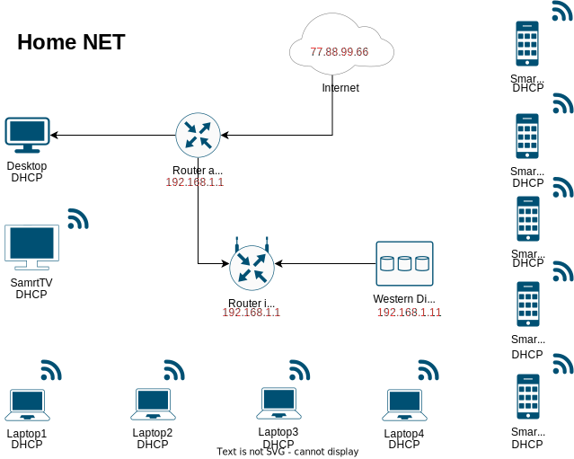

# Домашнее задание к занятию "3.8. Компьютерные сети, лекция 3"

1. Подключитесь к публичному маршрутизатору в интернет. Найдите маршрут к вашему публичному IP

    ```
    telnet route-views.routeviews.org
    Username: rviews
    show ip route x.x.x.x/32
    show bgp x.x.x.x/32
    ```

    ---

    * Мой внешний IP **88.201.188.40**

    ```bash
    vagrant@vagrant:~$ telnet route-views.routeviews.org
    Trying 128.223.51.103...
    Connected to route-views.routeviews.org.
    Escape character is '^]'.
    C
    **********************************************************************

                        RouteViews BGP Route Viewer
                        route-views.routeviews.org

    route views data is archived on http://archive.routeviews.org

    This hardware is part of a grant by the NSF.
    Please contact help@routeviews.org if you have questions, or
    if you wish to contribute your view.

    This router has views of full routing tables from several ASes.
    The list of peers is located at http://www.routeviews.org/peers
    in route-views.oregon-ix.net.txt

    NOTE: The hardware was upgraded in August 2014.  If you are seeing
    the error message, "no default Kerberos realm", you may want to
    in Mac OS X add "default unset autologin" to your ~/.telnetrc

    To login, use the username "rviews".

    **********************************************************************


    User Access Verification

    Username: rviews
    route-views>show ip route 88.201.188.40/32
                                        ^
    % Invalid input detected at '^' marker.

    route-views>show ip route 88.201.188.40
    Routing entry for 88.201.128.0/18
    Known via "bgp 6447", distance 20, metric 0
    Tag 8283, type external
    Last update from 94.142.247.3 1d02h ago
    Routing Descriptor Blocks:
    * 94.142.247.3, from 94.142.247.3, 1d02h ago
        Route metric is 0, traffic share count is 1
        AS Hops 4
        Route tag 8283
        MPLS label: none
    route-views>show bgp 88.201.188.40
    BGP routing table entry for 88.201.128.0/18, version 323190936
    Paths: (2 available, best #2, table default)
    Not advertised to any peer
    Refresh Epoch 1
    3333 1103 20562 35807
        193.0.0.56 from 193.0.0.56 (193.0.0.56)
        Origin IGP, localpref 100, valid, external, atomic-aggregate
        Community: 20562:45 20562:3120 20562:4001 20562:65000 20562:65020
        path 7FE1041FD980 RPKI State not found
        rx pathid: 0, tx pathid: 0
    Refresh Epoch 1
    8283 15703 20562 35807
        94.142.247.3 from 94.142.247.3 (94.142.247.3)
        Origin IGP, metric 0, localpref 100, valid, external, atomic-aggregate, best
        Community: 8283:10 15703:652 15703:800 15703:65222 20562:45 20562:3120 20562:4001 20562:65000 20562:65020
        unknown transitive attribute: flag 0xE0 type 0x20 length 0xC
            value 0000 205B 0000 0006 0000 000A
        path 7FE0F1584008 RPKI State not found
        rx pathid: 0, tx pathid: 0x0
    route-views>exit
    Connection closed by foreign host.
    ```

    ---

2. Создайте dummy0 интерфейс в Ubuntu. Добавьте несколько статических маршрутов. Проверьте таблицу маршрутизации.

    ---

    ```bash
    vagrant@vagrant:~$ sudo su -c 'echo "dummy" >> /etc/modules'
    vagrant@vagrant:~$ sudo su -c 'echo "options dummy numdummies=2" > /etc/modprobe.d/dummy.conf'
    vagrant@vagrant:~$ cat /etc/network/interfaces
    auto dummy0
    iface dummy0 inet static
    address 10.2.2.2/32
    pre-up ip link add dummy0 type dummy
    post-down ip link del dummy0

    vagrant@vagrant:~$ ip a
    1: lo: <LOOPBACK,UP,LOWER_UP> mtu 65536 qdisc noqueue state UNKNOWN group default qlen 1000
        link/loopback 00:00:00:00:00:00 brd 00:00:00:00:00:00
        inet 127.0.0.1/8 scope host lo
        valid_lft forever preferred_lft forever
        inet6 ::1/128 scope host
        valid_lft forever preferred_lft forever
    2: eth0: <BROADCAST,MULTICAST,UP,LOWER_UP> mtu 1500 qdisc fq_codel state UP group default qlen 1000
        link/ether 08:00:27:b1:28:5d brd ff:ff:ff:ff:ff:ff
        inet 10.0.2.15/24 brd 10.0.2.255 scope global dynamic eth0
        valid_lft 84517sec preferred_lft 84517sec
        inet6 fe80::a00:27ff:feb1:285d/64 scope link
        valid_lft forever preferred_lft forever
    3: dummy0: <BROADCAST,NOARP,UP,LOWER_UP> mtu 1500 qdisc noqueue state UNKNOWN group default qlen 1000
        link/ether 9e:3c:1d:c7:d1:85 brd ff:ff:ff:ff:ff:ff
        inet 10.2.2.2/32 brd 10.2.2.2 scope global dummy0
        valid_lft forever preferred_lft forever
        inet6 fe80::9c3c:1dff:fec7:d185/64 scope link
        valid_lft forever preferred_lft forever

    vagrant@vagrant:~$ sudo ip route add 10.2.2.2/32 dev eth0 metric 200
    vagrant@vagrant:~$ sudo ip route add 192.168.1.0/24 via 10.0.2.1
    vagrant@vagrant:~$ sudo ip route add 192.168.1.0/24 via 10.2.2.2 metric 300

    vagrant@vagrant:~$ ip route
    default via 10.0.2.2 dev eth0 proto dhcp src 10.0.2.15 metric 100
    10.0.2.0/24 dev eth0 proto kernel scope link src 10.0.2.15
    10.0.2.2 dev eth0 proto dhcp scope link src 10.0.2.15 metric 100
    10.2.2.2 dev eth0 scope link metric 200
    192.168.1.0/24 via 10.0.2.1 dev eth0
    192.168.1.0/24 via 10.2.2.2 dev dummy0 metric 300

    vagrant@vagrant:~$ ip route show 192.168.1.15/24
    192.168.1.0/24 via 10.0.2.1 dev eth0
    vagrant@vagrant:~$ sudo ip route show 10.2.2.2
    10.2.2.2 dev eth0 scope link metric 200
    vagrant@vagrant:~$ sudo ip route show 10.0.2.0/24
    10.0.2.0/24 dev eth0 proto kernel scope link src 10.0.2.15
    vagrant@vagrant:~$ sudo ip route show 10.0.2.2
    10.0.2.2 dev eth0 proto dhcp scope link src 10.0.2.15 metric 100
    ```

    ---

3. Проверьте открытые TCP порты в Ubuntu, какие протоколы и приложения используют эти порты? Приведите несколько примеров.

    ---

    ```bash
    vagrant@vagrant:~$ sudo ss -ltp
    State          Recv-Q         Send-Q                 Local Address:Port                     Peer Address:Port         Process
    LISTEN         0              4096                   127.0.0.53%lo:domain                        0.0.0.0:*             users:(("systemd-resolve",pid=658,fd=13))
    LISTEN         0              128                          0.0.0.0:ssh                           0.0.0.0:*             users:(("sshd",pid=734,fd=3))
    LISTEN         0              128                             [::]:ssh                              [::]:*             users:(("sshd",pid=734,fd=4))

    vagrant@vagrant:~$ sudo ss -lntp
    State          Recv-Q         Send-Q                   Local Address:Port                   Peer Address:Port         Process
    LISTEN         0              4096                     127.0.0.53%lo:53                          0.0.0.0:*             users:(("systemd-resolve",pid=658,fd=13))
    LISTEN         0              128                            0.0.0.0:22                          0.0.0.0:*             users:(("sshd",pid=734,fd=3))
    LISTEN         0              128                               [::]:22                             [::]:*             users:(("sshd",pid=734,fd=4))
    ```

    * В данном примере открыты на прослушивание порты:

        * **TCP: 53** - DNS, получение информации о доменах, открыт процессом `systemd-resolve`;
        * **TCP: 22** (IPv4 и IPv6) - SSH, протокол безопасной передачи данных, открыт процессом `sshd`.

    ---

4. Проверьте используемые UDP сокеты в Ubuntu, какие протоколы и приложения используют эти порты?

    ---

    ```bash
    vagrant@vagrant:~$ sudo ss -lup
    State          Recv-Q         Send-Q                  Local Address:Port                    Peer Address:Port         Process
    UNCONN         0              0                       127.0.0.53%lo:domain                       0.0.0.0:*             users:(("systemd-resolve",pid=658,fd=12))
    UNCONN         0              0                      10.0.2.15%eth0:bootpc                       0.0.0.0:*             users:(("systemd-network",pid=656,fd=19))
    UNCONN         0              0                             0.0.0.0:snmp                         0.0.0.0:*             users:(("snmpd",pid=696,fd=6))

    vagrant@vagrant:~$ sudo ss -lnup
    State          Recv-Q         Send-Q                   Local Address:Port                   Peer Address:Port         Process
    UNCONN         0              0                        127.0.0.53%lo:53                          0.0.0.0:*             users:(("systemd-resolve",pid=658,fd=12))
    UNCONN         0              0                       10.0.2.15%eth0:68                          0.0.0.0:*             users:(("systemd-network",pid=656,fd=19))
    UNCONN         0              0                              0.0.0.0:161                         0.0.0.0:*             users:(("snmpd",pid=696,fd=6))

    ```

    * В данном примере открыты на прослушивание порты:

        * **UDP: 53** - DNS, получение информации о доменах, открыт процессом `systemd-resolve`;
        * **UDP: 68** - BOOTPC/DHCP, используется бездисковыми рабочими станциями, загружающимися с сервера BOOTP, или DHCP. Порт открыт процессом `systemd-network`;
        * **UDP: 161** - SNMP, протокол управления сетевыми устройствами, открыт процессом `systemd-resolve`.

    ---

5. Используя diagrams.net, создайте L3 диаграмму вашей домашней сети или любой другой сети, с которой вы работали.

    ---

    