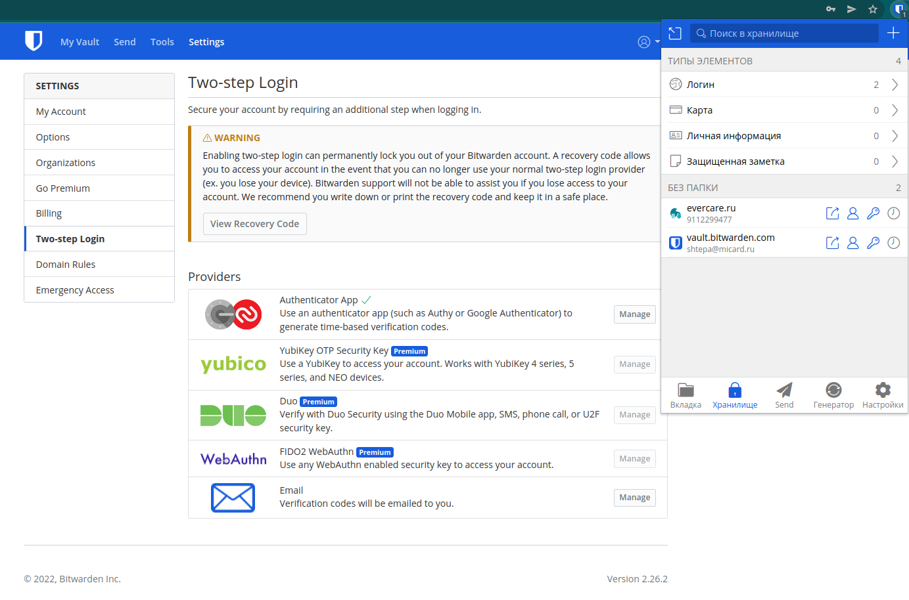
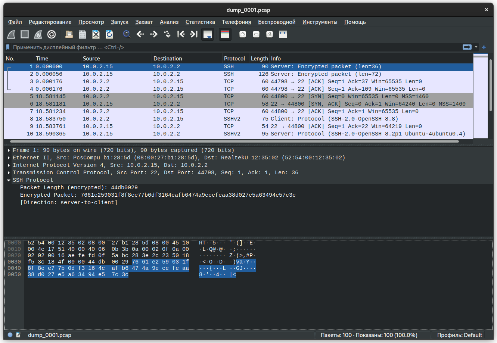

# Домашнее задание к занятию "3.9. Элементы безопасности информационных систем"

1. Установите Bitwarden плагин для браузера. Зарегестрируйтесь и сохраните несколько паролей.

    ---

    * Зарегистрировался на сайте [bitwarden.com](https://bitwarden.com/)
    * Установил плагин для браузера [Chrome](https://chrome.google.com/webstore/detail/bitwarden-free-password-m/nngceckbapebfimnlniiiahkandclblb?hl=ru)
    * Сохранил пароли 

    ---

2. Установите Google authenticator на мобильный телефон. Настройте вход в Bitwarden акаунт через Google authenticator OTP.

    ---

    * Установил на смартфон **Google authenticator**.
    * В личном кабинете настроил двухфакторную авторизацию через Google authenticator.

        

    ---

3. Установите apache2, сгенерируйте самоподписанный сертификат, настройте тестовый сайт для работы по HTTPS.

    ---

    ```bash
    vagrant@vagrant:~$ sudo apt update
    ...
    vagrant@vagrant:~$ sudo apt upgrade
    ...
    vagrant@vagrant:~$ sudo apt install apache2
    ...
    vagrant@vagrant:~$ sudo a2enmod ssl
    Considering dependency setenvif for ssl:
    Module setenvif already enabled
    Considering dependency mime for ssl:
    Module mime already enabled
    Considering dependency socache_shmcb for ssl:
    Enabling module socache_shmcb.
    Enabling module ssl.
    See /usr/share/doc/apache2/README.Debian.gz on how to configure SSL and create self-signed certificates.
    To activate the new configuration, you need to run:
    systemctl restart apache2

    vagrant@vagrant:~$ sudo systemctl restart apache2
    vagrant@vagrant:~$ sudo openssl req -x509 -nodes -days 365 -newkey rsa:2048 -keyout /etc/ssl/private/apache-selfsigned.key -out /etc/ssl/certs/apache-selfsigned.crt -subj "/C=RU/ST=Saint-Petersburg/L=Saint-Petersburg/O=MICARD-LANA/OU=Org/CN=www.micard.ru"
    vagrant@vagrant:~$ cat /etc/apache2/sites-available/micard.ru.conf
    <VirtualHost *:443>
        ServerName micard.ru
        DocumentRoot /var/www/micard.ru
        SSLEngine on
        SSLCertificateFile /etc/ssl/certs/apache-selfsigned.crt
        SSLCertificateKeyFile /etc/ssl/private/apache-selfsigned.key
    </VirtualHost>
    vagrant@vagrant:~$ sudo mkdir /var/www/micard.ru
    vagrant@vagrant:~$ sudo vim /var/www/micard.ru/index.html
    vagrant@vagrant:~$ cat /var/www/micard.ru/index.html 
    <h1>it worked!</h1>
    vagrant@vagrant:~$ sudo a2ensite micard.ru.conf
    Enabling site micard.ru.
    To activate the new configuration, you need to run:
    systemctl reload apache2

    vagrant@vagrant:~$ sudo apache2ctl configtest
    AH00558: apache2: Could not reliably determine the server's fully qualified domain name, using 127.0.1.1. Set the 'ServerName' directive globally to suppress this message
    Syntax OK
    vagrant@vagrant:~$ sudo systemctl reload apache2

    vagrant@vagrant:~$ http https://localhost
    http: error: SSLError: HTTPSConnectionPool(host='localhost', port=443): Max retries exceeded with url: / (Caused by SSLError(SSLError("bad handshake: Error([('SSL routines', 'tls_process_server_certificate', 'certificate verify failed')])"))) while doing GET request to URL: https://localhost/

    vagrant@vagrant:~$ http --debug --verify false https://localhost
    HTTPie 1.0.3
    Requests 2.22.0
    Pygments 2.3.1
    Python 3.8.10 (default, Nov 26 2021, 20:14:08) 
    [GCC 9.3.0]
    /usr/bin/python3
    Linux 5.4.0-91-generic

    <Environment {
        "colors": 256,
        "config": {
            "__meta__": {
                "about": "HTTPie configuration file",
                "help": "https://httpie.org/doc#config",
                "httpie": "1.0.3"
            },
            "default_options": "[]"
        },
        "config_dir": "/home/vagrant/.httpie",
        "is_windows": false,
        "stderr": "<_io.TextIOWrapper name='<stderr>' mode='w' encoding='utf-8'>",
        "stderr_isatty": true,
        "stdin": "<_io.TextIOWrapper name='<stdin>' mode='r' encoding='utf-8'>",
        "stdin_encoding": "utf-8",
        "stdin_isatty": true,
        "stdout": "<_io.TextIOWrapper name='<stdout>' mode='w' encoding='utf-8'>",
        "stdout_encoding": "utf-8",
        "stdout_isatty": true
    }>

    >>> requests.request(**{
        "allow_redirects": false,
        "auth": "None",
        "cert": "None",
        "data": {},
        "files": {},
        "headers": {
            "User-Agent": "HTTPie/1.0.3"
        },
        "method": "get",
        "params": {},
        "proxies": {},
        "stream": true,
        "timeout": 30,
        "url": "https://localhost",
        "verify": false
    })

    HTTP/1.1 200 OK
    Accept-Ranges: bytes
    Connection: Keep-Alive
    Content-Length: 20
    Content-Type: text/html
    Date: Thu, 03 Mar 2022 12:26:22 GMT
    ETag: "14-5d94f4e7a8c65"
    Keep-Alive: timeout=5, max=100
    Last-Modified: Thu, 03 Mar 2022 12:12:05 GMT
    Server: Apache/2.4.41 (Ubuntu)

    <h1>it worked!</h1>
    ```

    ---

4. Проверьте на TLS уязвимости произвольный сайт в интернете (кроме сайтов МВД, ФСБ, МинОбр, НацБанк, РосКосмос, РосАтом, РосНАНО и любых госкомпаний, объектов КИИ, ВПК ... и тому подобное).

    ---

    ```bash
    vagrant@vagrant:~$ git clone --depth 1 https://github.com/drwetter/testssl.sh.git
    Cloning into 'testssl.sh'...
    remote: Enumerating objects: 100, done.
    remote: Counting objects: 100% (100/100), done.
    remote: Compressing objects: 100% (93/93), done.
    remote: Total 100 (delta 14), reused 22 (delta 6), pack-reused 0
    Receiving objects: 100% (100/100), 8.55 MiB | 4.27 MiB/s, done.
    Resolving deltas: 100% (14/14), done.

    vagrant@vagrant:~$ cd testssl.sh

    vagrant@vagrant:~/testssl.sh$ ./testssl.sh -U --sneaky https://micard.ru/

    ###########################################################
        testssl.sh       3.1dev from https://testssl.sh/dev/
        (f73bc44 2022-03-02 17:13:41 -- )

        This program is free software. Distribution and
                modification under GPLv2 permitted.
        USAGE w/o ANY WARRANTY. USE IT AT YOUR OWN RISK!

        Please file bugs @ https://testssl.sh/bugs/

    ###########################################################

    Using "OpenSSL 1.0.2-chacha (1.0.2k-dev)" [~183 ciphers]
    on vagrant:./bin/openssl.Linux.x86_64
    (built: "Jan 18 17:12:17 2019", platform: "linux-x86_64")


    Start 2022-03-03 13:02:36        -->> 77.222.61.135:443 (micard.ru) <<--

    rDNS (77.222.61.135):   vh32.sweb.ru.
    Service detected:       HTTP


    Testing vulnerabilities 

    Heartbleed (CVE-2014-0160)                not vulnerable (OK), timed out
    CCS (CVE-2014-0224)                       not vulnerable (OK)
    Ticketbleed (CVE-2016-9244), experiment.  not vulnerable (OK)
    ROBOT                                     not vulnerable (OK)
    Secure Renegotiation (RFC 5746)           supported (OK)
    Secure Client-Initiated Renegotiation     not vulnerable (OK)
    CRIME, TLS (CVE-2012-4929)                not vulnerable (OK)
    BREACH (CVE-2013-3587)                    potentially NOT ok, "gzip" HTTP compression detected. - only supplied "/" tested
                                            Can be ignored for static pages or if no secrets in the page
    POODLE, SSL (CVE-2014-3566)               not vulnerable (OK)
    TLS_FALLBACK_SCSV (RFC 7507)              Downgrade attack prevention supported (OK)
    SWEET32 (CVE-2016-2183, CVE-2016-6329)    not vulnerable (OK)
    FREAK (CVE-2015-0204)                     not vulnerable (OK)
    DROWN (CVE-2016-0800, CVE-2016-0703)      not vulnerable on this host and port (OK)
                                            make sure you don't use this certificate elsewhere with SSLv2 enabled services
                                            https://censys.io/ipv4?q=8FEA09356C01C1AD997E223C5966B00641494EFAD7207F4C2040B5CC16B3552F could help you to find out
    LOGJAM (CVE-2015-4000), experimental      not vulnerable (OK): no DH EXPORT ciphers, no common prime detected
    BEAST (CVE-2011-3389)                     not vulnerable (OK), no SSL3 or TLS1
    LUCKY13 (CVE-2013-0169), experimental     potentially VULNERABLE, uses cipher block chaining (CBC) ciphers with TLS. Check patches
    Winshock (CVE-2014-6321), experimental    not vulnerable (OK) - CAMELLIA or ECDHE_RSA GCM ciphers found
    RC4 (CVE-2013-2566, CVE-2015-2808)        no RC4 ciphers detected (OK)


    Done 2022-03-03 13:03:48 [  73s] -->> 77.222.61.135:443 (micard.ru) <<--
    ```

    ---

5. Установите на Ubuntu ssh сервер, сгенерируйте новый приватный ключ. Скопируйте свой публичный ключ на другой сервер. Подключитесь к серверу по SSH-ключу.

    ---

    * Установил сервер SSH и поставил его в автозагрузку как службу:

    ```bash
    vagrant@vagrant:~$ sudo apt install openssh-server
    ...
    vagrant@vagrant:~$ sudo systemctl enable --now ssh
    Synchronizing state of ssh.service with SysV service script with /lib/systemd/systemd-sysv-install.
    Executing: /lib/systemd/systemd-sysv-install enable ssh
    ```

    * На хост-машине сгенерировал пару ключей используя алгоритм ED25519, публичный ключ отправил в виртуальную машину:

    ```bash
    vagrant2@vagrant2:~$ ssh-keygen -t ed25519
    Generating public/private ed25519 key pair.
    Enter file in which to save the key (/home/vagrant/.ssh/id_ed25519): 
    Enter passphrase (empty for no passphrase): 
    Enter same passphrase again: 
    Your identification has been saved in /home/vagrant/.ssh/id_ed25519
    Your public key has been saved in /home/vagrant/.ssh/id_ed25519.pub
    The key fingerprint is:
    SHA256:vmJ9Ey1KgrSjQHvty7jZWYDF+Ti8JGovkKIqg/G97gc vagrant@vagrant
    The key's randomart image is:
    +--[ED25519 256]--+
    |                 |
    |    . .          |
    |     +           |
    | .  = o          |
    |...+.O .S  .     |
    |*...E.=.. o .    |
    |=*.o.+ =.. o     |
    |*.+ *.* o.o      |
    |+..B=O.... .     |
    +----[SHA256]-----+

    vagrant2@vagrant2:~$ ssh-copy-id -p2222 vagrant@localhost
    The authenticity of host '[localhost]:2222 ([127.0.0.1]:2222)' can't be established.
    ED25519 key fingerprint is SHA256:pXmmAKZKpR2tNHiegc8ZtsEI6lvlm1uSRnFEFuFj9UM.
    This key is not known by any other names
    Are you sure you want to continue connecting (yes/no/[fingerprint])? yes
    /usr/bin/ssh-copy-id: INFO: attempting to log in with the new key(s), to filter out any that are already installed
    /usr/bin/ssh-copy-id: INFO: 1 key(s) remain to be installed -- if you are prompted now it is to install the new keys
    vagrant@localhost's password: 

    Number of key(s) added: 1

    Now try logging into the machine, with:   "ssh -p '2222' 'vagrant@localhost'"
    and check to make sure that only the key(s) you wanted were added.
    ```

    * В виртуальной машине отключил подключение по SSH с использованием логина/пароля, осталось только подключение по ключу:

    ```bash
    vagrant@vagrant:~$ sudo vim /etc/ssh/sshd_config
    vagrant@vagrant:~$ cat /etc/ssh/sshd_config
    ...
    PasswordAuthentication no
    ...
    vagrant@vagrant:~$ sudo systemctl restart ssh
    ```

    * Подключился по ключу:

    ```bash
    vagrant2@vagrant2:~$ ssh -p2222 vagrant@localhost
    Welcome to Ubuntu 20.04.4 LTS (GNU/Linux 5.4.0-91-generic x86_64)
    ...
    vagrant@vagrant:~$
    ```

    ---

6. Переименуйте файлы ключей из задания 5. Настройте файл конфигурации SSH клиента, так чтобы вход на удаленный сервер осуществлялся по имени сервера.

    ---

    * Переименовал файлы ключей:

    ```bash
    vagrant2@vagrant2:~$ mv ~/.ssh/id_ed25519 ~/.ssh/vagrant
    vagrant2@vagrant2:~$ mv ~/.ssh/id_ed25519.pub ~/.ssh/vagrant.pub
    ```

    * Создал конфигурационный файл для клиента SSH:

    ```bash
    vagrant2@vagrant2:~$ cat ~/.ssh/config
    Host vagrant
        Hostname    localhost
        Port        2222
        User        vagrant
        IdentityFile ~/.ssh/vagrant
    ```

    * Подключился к виртуальной машине по её имени:

    ```bash
    vagrant2@vagrant2:~$ ssh vagrant
    Welcome to Ubuntu 20.04.4 LTS (GNU/Linux 5.4.0-91-generic x86_64)
    ...
    vagrant@vagrant:~$
    ```

    ---

7. Соберите дамп трафика утилитой tcpdump в формате pcap, 100 пакетов. Откройте файл pcap в Wireshark.

    * Захватить 100 пакетов трафика и сохранить в файл `dump_0001.pcap`:

    ```bash
    vagrant@vagrant:~$ sudo tcpdump -w dump_0001.pcap -c 100 -i eth0
    tcpdump: listening on eth0, link-type EN10MB (Ethernet), capture size 262144 bytes
    100 packets captured
    101 packets received by filter
    0 packets dropped by kernel
    ```

    * Загрузил дамп в **Wireshark**:

        

 ---

## Задание для самостоятельной отработки (необязательно к выполнению)

8*. Просканируйте хост scanme.nmap.org. Какие сервисы запущены?

9*. Установите и настройте фаервол ufw на web-сервер из задания 3. Откройте доступ снаружи только к портам 22,80,443
