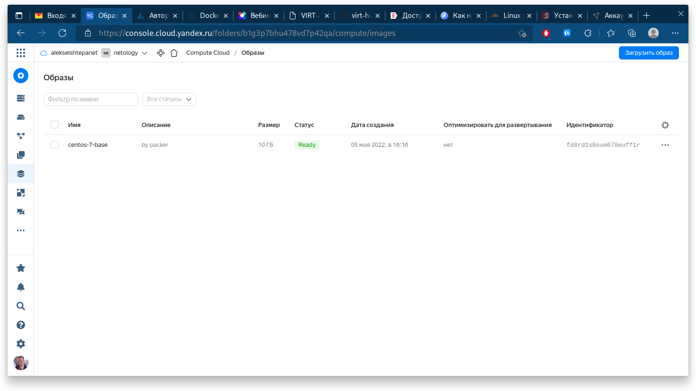
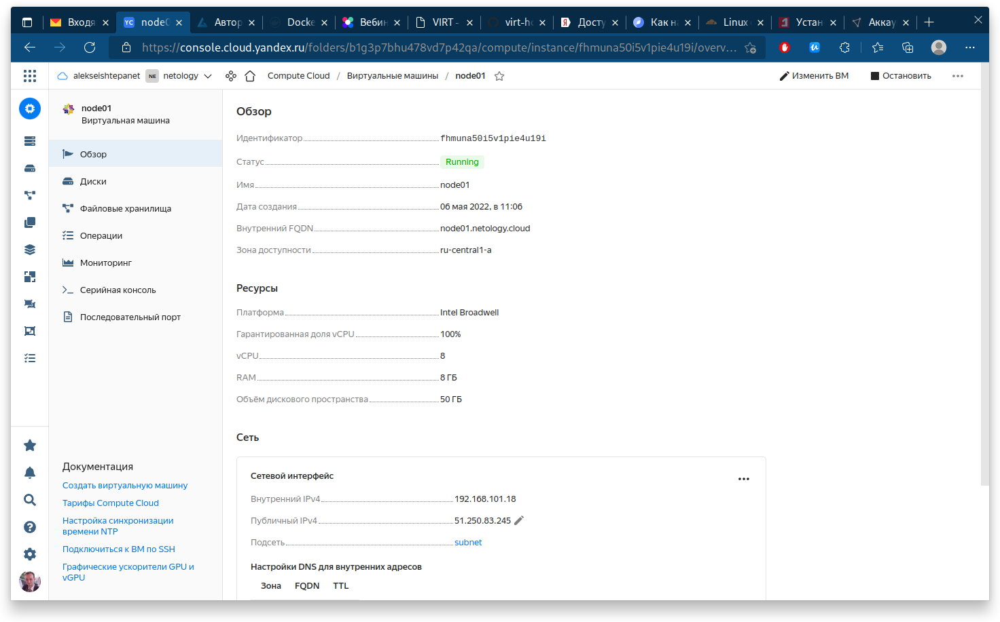
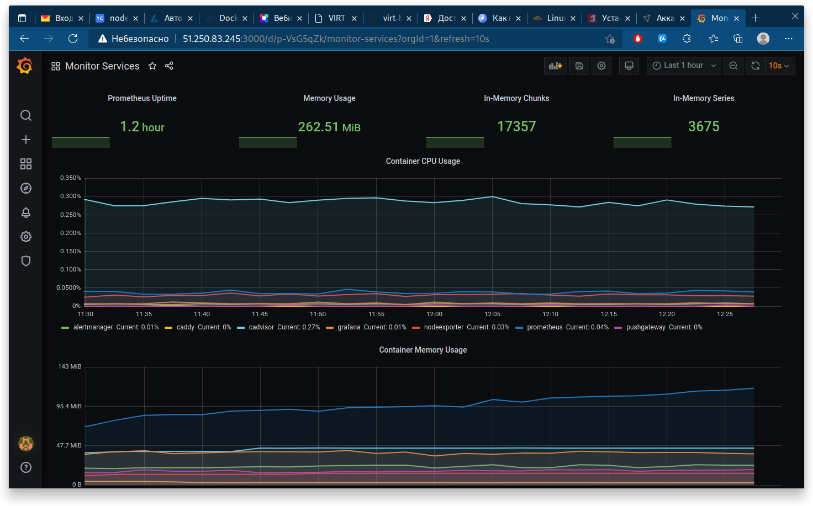

# Домашнее задание к занятию "5.4. Оркестрация группой Docker контейнеров на примере Docker Compose"

## Задача 1

> Создать собственный образ операционной системы с помощью Packer.
>
> Для получения зачета, вам необходимо предоставить:
> - Скриншот страницы, как на слайде из презентации (слайд 37).

```bash
 ~/w/n/d/s/0/0/ansible ❯ ansible-playbook provision.yml

PLAY [nodes] **********************************************************************************************************************************************************************************

TASK [Gathering Facts] ************************************************************************************************************************************************************************
The authenticity of host '51.250.83.245 (51.250.83.245)' can't be established.
ED25519 key fingerprint is SHA256:BeEQzmL+dKQF56Ohjr3jDUVlLAg4/eJltCdR1CyvkRY.
This key is not known by any other names
Are you sure you want to continue connecting (yes/no/[fingerprint])? yes
ok: [node01.netology.cloud]

TASK [Create directory for ssh-keys] **********************************************************************************************************************************************************
ok: [node01.netology.cloud]

TASK [Adding rsa-key in /root/.ssh/authorized_keys] *******************************************************************************************************************************************
changed: [node01.netology.cloud]

TASK [Checking DNS] ***************************************************************************************************************************************************************************
changed: [node01.netology.cloud]

TASK [Installing tools] ***********************************************************************************************************************************************************************
changed: [node01.netology.cloud] => (item=['git', 'curl'])

TASK [Add docker repository] ******************************************************************************************************************************************************************
changed: [node01.netology.cloud]

TASK [Installing docker package] **************************************************************************************************************************************************************
changed: [node01.netology.cloud] => (item=['docker-ce', 'docker-ce-cli', 'containerd.io'])

TASK [Enable docker daemon] *******************************************************************************************************************************************************************
changed: [node01.netology.cloud]

TASK [Install docker-compose] *****************************************************************************************************************************************************************
changed: [node01.netology.cloud]

TASK [Synchronization] ************************************************************************************************************************************************************************
changed: [node01.netology.cloud]

TASK [Pull all images in compose] *************************************************************************************************************************************************************
changed: [node01.netology.cloud]

TASK [Up all services in compose] *************************************************************************************************************************************************************
changed: [node01.netology.cloud]

PLAY RECAP ************************************************************************************************************************************************************************************
node01.netology.cloud      : ok=12   changed=10   unreachable=0    failed=0    skipped=0    rescued=0    ignored=0   
```



## Задача 2

> Создать вашу первую виртуальную машину в Яндекс.Облаке.
>
> Для получения зачета, вам необходимо предоставить:
> - Скриншот страницы свойств созданной ВМ, как на примере ниже:



## Задача 3

> Создать ваш первый готовый к боевой эксплуатации компонент мониторинга, состоящий из стека микросервисов.
>
> Для получения зачета, вам необходимо предоставить:
> - Скриншот работающего веб-интерфейса Grafana с текущими метриками, как на примере ниже



## Задача 4 (*)

> Создать вторую ВМ и подключить её к мониторингу развёрнутому на первом сервере.
>
> Для получения зачета, вам необходимо предоставить:
> - Скриншот из Grafana, на котором будут отображаться метрики добавленного вами сервера.

Дополнительную задачу не делал.