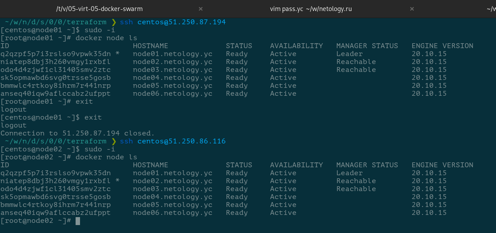
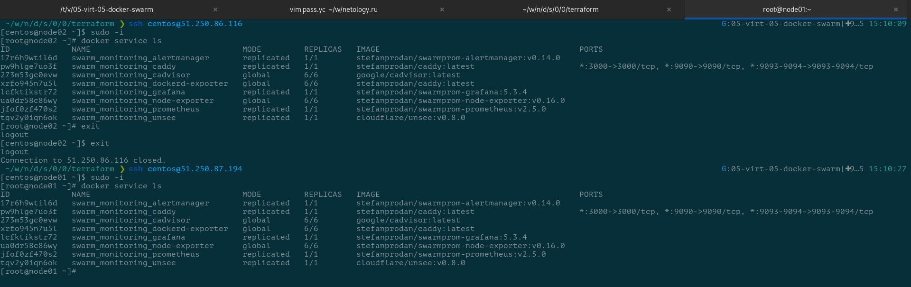

# Домашнее задание к занятию "5.5. Оркестрация кластером Docker контейнеров на примере Docker Swarm"

## Задача 1

> Дайте письменые ответы на следующие вопросы:
>
> - В чём отличие режимов работы сервисов в Docker Swarm кластере: replication и global?

Сервисы запущенные в Docker Swarm кластере в режиме **replication** будут иметь указанное количество реплик. То есть внутри кластера всегда должно существовать указанное количество копий сервиса.

Режим **global** означает, что сервис необходимо запустить на всех узлах кластера.

> - Какой алгоритм выбора лидера используется в Docker Swarm кластере?

В кластере используется алгоритм консенсуса [Raft](https://raft.github.io/) для определения лидера.

> - Что такое Overlay Network?

Это виртуальная подсеть, которую создаёт Docker Swarm поверх других сетей для организации связи между узлами кластера, расположенных на разных хостах.

## Задача 2

> Создать ваш первый Docker Swarm кластер в Яндекс.Облаке
>
> Для получения зачета, вам необходимо предоставить скриншот из терминала (консоли), с выводом команды:
>
> ```bash
> docker node ls
> ```



## Задача 3

> Создать ваш первый, готовый к боевой эксплуатации кластер мониторинга, состоящий из стека микросервисов.
>
> Для получения зачета, вам необходимо предоставить скриншот из терминала (консоли), с выводом команды:
>
> ```bash
> docker service ls
> ```



## Задача 4 (*)

> Выполнить на лидере Docker Swarm кластера команду (указанную ниже) и дать письменное описание её функционала, что она делает и зачем она нужна:
>
> ```bash
> # см.документацию: https://docs.docker.com/engine/swarm/swarm_manager_locking/
> docker swarm update --autolock=true
> ```

Команда включает режим автоматической блокировки менеджера работающего Swarm-кластера.

Когда Docker Swarm работает, его Raft-логи защищены от атак злоумышленников шифрованием. Во время запуска Docker`а (старта демона) в режиме автоматической блокировки потребуется ручная разблокировка менеджера кластера. Пока менеджер не будет разблокирован его узел будет исключён из кластера.
