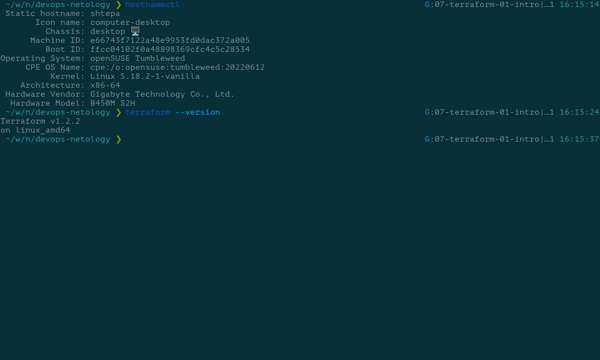
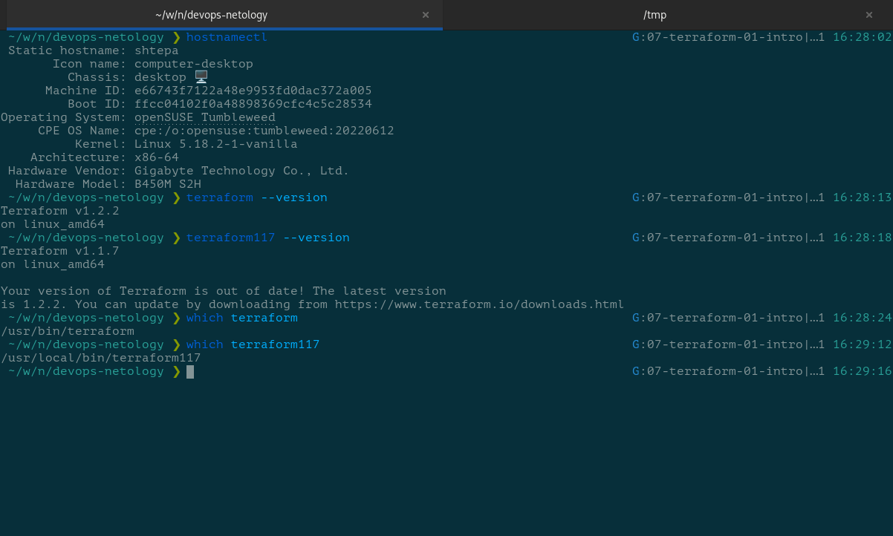

# Домашнее задание к занятию "7.1. Инфраструктура как код"

## Задача 1. Выбор инструментов

### Легенда

Через час совещание на котором менеджер расскажет о новом проекте. Начать работу над которым надо будет уже сегодня. На данный момент известно, что это будет сервис, который ваша компания будет предоставлять внешним заказчикам. Первое время, скорее всего, будет один внешний клиент, со временем внешних клиентов станет больше.

Так же по разговорам в компании есть вероятность, что техническое задание еще не четкое, что приведет к большому
количеству небольших релизов, тестирований интеграций, откатов, доработок, то есть скучно не будет.  

Вам, как девопс инженеру, будет необходимо принять решение об инструментах для организации инфраструктуры. На данный момент в вашей компании уже используются следующие инструменты:

- остатки Сloud Formation,
- некоторые образы сделаны при помощи Packer,
- год назад начали активно использовать Terraform,
- разработчики привыкли использовать Docker,
- уже есть большая база Kubernetes конфигураций,
- для автоматизации процессов используется Teamcity,
- также есть совсем немного Ansible скриптов,
- и ряд bash скриптов для упрощения рутинных задач.  

Для этого в рамках совещания надо будет выяснить подробности о проекте, что бы в итоге определиться с инструментами:

1. Какой тип инфраструктуры будем использовать для этого проекта: изменяемый или не изменяемый?
1. Будет ли центральный сервер для управления инфраструктурой?
1. Будут ли агенты на серверах?
1. Будут ли использованы средства для управления конфигурацией или инициализации ресурсов?

В связи с тем, что проект стартует уже сегодня, в рамках совещания надо будет определиться со всеми этими вопросами.

### В результате задачи необходимо

1. Ответить на четыре вопроса представленных в разделе "Легенда". 
1. Какие инструменты из уже используемых вы хотели бы использовать для нового проекта?
1. Хотите ли рассмотреть возможность внедрения новых инструментов для этого проекта?

Если для ответа на эти вопросы недостаточно информации, то напишите какие моменты уточните на совещании.

### Решение

> Какой тип инфраструктуры будем использовать для этого проекта: изменяемый или не изменяемый?

Проект предполагает экспериментирование и активное уточнение требований. Не хотелось бы путаться в конфигурациях и разбираться в их дрейфе.

Выбираем неизменяемый тип инфраструктуры, но используем контейнеризацию вместо виртуализации. Скорость манипуляции с контейнерами значительно выше, чем оперирование виртуальными машинами.

> Будет ли центральный сервер для управления инфраструктурой?

Использование центрального сервера для управления инфраструктурой будет единой точкой отказа в случае возникновения с ним проблем. Так же необходимо будет на каждый узел инфраструктуры устанавливать агентов. Единственным плюсом инфраструктурного сервера я считаю автоматический мониторинг узлов и организация оповещений.

Использовать центральный сервер для управления инфраструктурой не планирую. Мониторинг инфраструктуры и оповещения будут реализованы другими инструментами.

> Будут ли агенты на серверах?

Нет, размещение агентов в узлах инфраструктуры не планируется как и самого инфраструктурного сервера.

> Будут ли использованы средства для управления конфигурацией или инициализации ресурсов?

Обязательно! В независимости от масштаба сервиса и количества его пользователей всё должно быть задокументировано. Документированная (формализованная) инфраструктура упрощает её обслуживание.

> Какие инструменты из уже используемых вы хотели бы использовать для нового проекта?

- Terraform для инициализации ресурсов;
- Ansible для управления конфигурациями серверов;
- Docker для шаблонизации серверов;
- Kubernetes для оркестрации.

> Хотите ли рассмотреть возможность внедрения новых инструментов для этого проекта?

DevOps-культура подразумевает эксперименты. Новые проекты -  это возможность опробовать новые методики или инструменты на практике. Если у команды есть задел по экспериментам, то его можно было бы внедрить. Возможно я бы попробовал контейнеризацию **cri-o** вместо **Docker**.

> Если для ответа на эти вопросы недостаточно информации, то напишите какие моменты уточните на совещании.

От DevOps-инженера на совещании должны прозвучать вопросы о целевой аудитории сервиса, о предполагаемом объёме и интенсивности обращений к сервису, об обрабатываемых данных и их доступности. Все эти вопросы влияют на архитектуру инфраструктуры и, соответственно, на инструментарий.

## Задача 2. Установка терраформ

> Официальный сайт: https://www.terraform.io/
>
>Установите терраформ при помощи менеджера пакетов используемого в вашей операционной системе. В виде результата этой задачи приложите вывод команды `terraform --version`.

## Задача 3. Поддержка легаси кода

> В какой-то момент вы обновили терраформ до новой версии, например с 0.12 до 0.13. А код одного из проектов настолько устарел, что не может работать с версией 0.13. В связи с этим необходимо сделать так, чтобы вы могли одновременно использовать последнюю версию терраформа установленную при помощи штатного менеджера пакетов и устаревшую версию 0.12.
>
>В виде результата этой задачи приложите вывод `--version` двух версий терраформа доступных на вашем компьютере или виртуальной машине.

