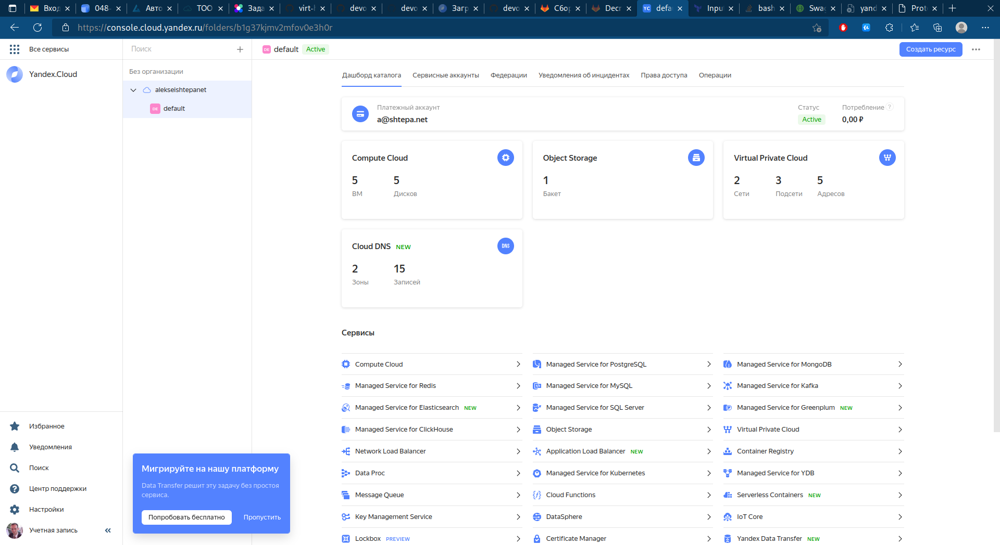
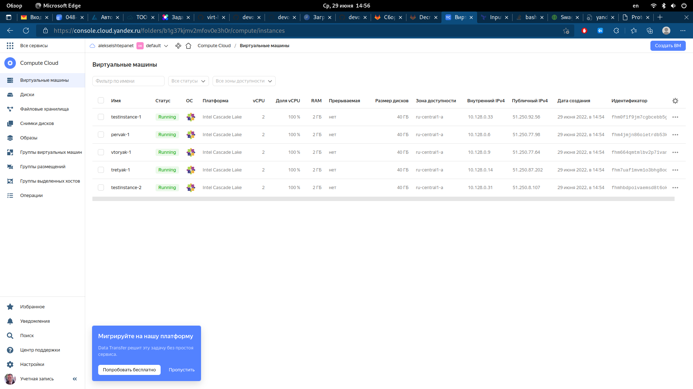

# Домашнее задание к занятию "7.3. Основы и принцип работы Терраформ"

## Задача 1. Создадим бэкэнд в S3 (необязательно, но крайне желательно).

> Если в рамках предыдущего задания у вас уже есть аккаунт AWS, то давайте продолжим знакомство со взаимодействием терраформа и aws.
>
> 1. Создайте s3 бакет, iam роль и пользователя от которого будет работать терраформ. Можно создать отдельного пользователя,
> а можно использовать созданного в рамках предыдущего задания, просто добавьте ему необходимы права, как описано 
> [здесь](https://www.terraform.io/docs/backends/types/s3.html).
> 1. Зарегистрируйте бэкэнд в терраформ проекте как описано по ссылке выше.

Следуя принципу "всё как код" попытался автоматизировать процесс создания корзины (bucket) объектного хранилища, iam-роли и пользователя, от имени которого будет работать терраформ. Эти действия оформлены отдельным [Terraform-проектом](./03-basic/terraform_local/).

Ресурсы создаются следующим кодом:

```terraform
resource "yandex_iam_service_account" "resource" {
  name        = "robot-resource"
  description = "testing service account"
}

# Назначаем сервисному аккаунту роль
resource "yandex_resourcemanager_folder_iam_binding" "editor" {
  folder_id = var.yc_folder_id

  role = "editor"

  members = [
    "serviceAccount:${yandex_iam_service_account.resource.id}",
  ]
}

# Создаём статические ключи доступа
resource "yandex_iam_service_account_static_access_key" "sa-static-key" {
  service_account_id = yandex_iam_service_account.resource.id
  description        = "static access key for object storage"
}

# Создаём корзину для объектного хранилища
resource "yandex_storage_bucket" "for_state" {
  access_key = yandex_iam_service_account_static_access_key.sa-static-key.access_key
  secret_key = yandex_iam_service_account_static_access_key.sa-static-key.secret_key
}
```

Для удобства использования имя корзины и ключи доступа к ней сохраняются в отдельные файлы:

```terraform
resource "local_file" "access_key" {
    content  = yandex_iam_service_account_static_access_key.sa-static-key.access_key
    filename = "access_key"
    file_permission = "0640"
}

resource "local_file" "secret_key" {
    content  = yandex_iam_service_account_static_access_key.sa-static-key.secret_key
    filename = "secret_key"
    file_permission = "0640"
}

resource "local_file" "bucket" {
    content  = yandex_storage_bucket.for_state.bucket
    filename = "bucket"
    file_permission = "0640"
}
```

## Задача 2. Инициализируем проект и создаем воркспейсы. 

> 1. Выполните `terraform init`:
    * если был создан бэкэнд в S3, то терраформ создат файл стейтов в S3 и запись в таблице dynamodb.
>    * иначе будет создан локальный файл со стейтами.  
> 2. Создайте два воркспейса `stage` и `prod`.

```bash
 ~/w/n/d/v/0/0/terraform_s3 ❯ terraform workspace new stage
Created and switched to workspace "stage"!

You're now on a new, empty workspace. Workspaces isolate their state,
so if you run "terraform plan" Terraform will not see any existing state
for this configuration.

 ~/w/n/d/v/0/0/terraform_s3 ❯ terraform workspace new prod
Created and switched to workspace "prod"!

You're now on a new, empty workspace. Workspaces isolate their state,
so if you run "terraform plan" Terraform will not see any existing state
for this configuration.

 ~/w/n/d/v/0/0/terraform_s3 ❯ terraform workspace select stage
Switched to workspace "stage".
```

> 3. В уже созданный `aws_instance` добавьте зависимость типа инстанса от вокспейса, что бы в разных ворскспейсах использовались разные `instance_type`.
> 1. Добавим `count`. Для `stage` должен создаться один экземпляр `ec2`, а для `prod` два. 

```terraform
module "instance_count" {
  source = "../modules/instance"
  instance_count = local.instance_count[terraform.workspace]

  subnet_id     = module.vpc.subnet_ids[0]
  zone = var.yc_region
  folder_id = module.vpc.folder_id
  platform_id   = "standard-v2"
  name          = "testinstance"
  description   = "Test instance Demo"
  instance_role = "testing"
  users         = "centos"
  cores         = local.cores[terraform.workspace]
  boot_disk     = "network-ssd"
  disk_size     = local.disk_size[terraform.workspace]
  nat           = "true"
  memory        = "2"
  core_fraction = "100"
  depends_on = [
    module.vpc
  ]
}
```

> 5. Создайте рядом еще один `aws_instance`, но теперь определите их количество при помощи `for_each`, а не `count`.

```terraform
module "instance_for_each" {
  source = "../modules/instance"

  for_each = local.nodes_name

  subnet_id     = module.vpc.subnet_ids[0]
  zone = var.yc_region
  folder_id = module.vpc.folder_id
  platform_id   = "standard-v2"
  name          = "${each.key}"
  description   = "${each.value}"
  instance_role = "testing"
  users         = "centos"
  cores         = local.cores[terraform.workspace]
  boot_disk     = "network-ssd"
  disk_size     = local.disk_size[terraform.workspace]
  nat           = "true"
  memory        = "2"
  core_fraction = "100"
  depends_on = [
    module.vpc
  ]
}
```

> 6. Что бы при изменении типа инстанса не возникло ситуации, когда не будет ни одного инстанса добавьте параметр жизненного цикла `create_before_destroy = true` в один из рессурсов `aws_instance`.

```terraform
resource "yandex_compute_instance" "instance" {
  count = var.instance_count
  name = "${var.name}-${format(var.count_format, var.count_offset+count.index+1)}"
  platform_id = var.platform_id
  hostname = "${var.name}-${format(var.count_format, var.count_offset+count.index+1)}"
  description = var.description
  zone = var.zone
  folder_id = var.folder_id

  resources {
    cores  = var.cores
    memory = var.memory
    core_fraction = var.core_fraction
  }
  boot_disk {
    initialize_params {
      image_id = data.yandex_compute_image.image.id
      type = var.boot_disk
      size = var.disk_size
    }
  }
  network_interface {
    subnet_id = var.subnet_id
    nat       = var.nat
  }

  metadata = {
    ssh-keys = "${var.users}:${file("~/.ssh/id_ed25519.pub")}"
  }

  lifecycle {
    create_before_destroy = true
  }
}
```

> 7. При желании поэкспериментируйте с другими параметрами и рессурсами.
>
> В виде результата работы пришлите:
> * Вывод команды `terraform workspace list`.
> * Вывод команды `terraform plan` для воркспейса `prod`.  

```bash
~/w/n/d/v/0/0/terraform_s3 ❯ terraform workspace list
  default
  prod
* stage

 ~/w/n/d/v/0/0/terraform_s3 ❯ terraform workspace select prod
Switched to workspace "prod".
```

```bash
 ~/w/n/d/v/0/0/terraform_s3 ❯ terraform plan -var="yc_token=$(yc config get token)" -var="yc_cloud_id=$(yc config get cloud-id)" -var="yc_folder_id=$(yc config get folder-id)"
module.vpc.data.yandex_compute_image.nat_instance: Reading...
module.vpc.data.yandex_compute_image.nat_instance: Read complete after 0s [id=fd84mnpg35f7s7b0f5lg]

Terraform used the selected providers to generate the following execution plan. Resource actions are indicated with the following symbols:
  + create
 <= read (data resources)

Terraform will perform the following actions:

  # module.instance_count.data.yandex_compute_image.image will be read during apply
  # (depends on a resource or a module with changes pending)
 <= data "yandex_compute_image" "image" {
      + created_at    = (known after apply)
      + description   = (known after apply)
      + family        = "centos-7"
      + folder_id     = (known after apply)
      + id            = (known after apply)
      + image_id      = (known after apply)
      + labels        = (known after apply)
      + min_disk_size = (known after apply)
      + name          = (known after apply)
      + os_type       = (known after apply)
      + product_ids   = (known after apply)
      + size          = (known after apply)
      + status        = (known after apply)
    }

  # module.instance_count.yandex_compute_instance.instance[0] will be created
  + resource "yandex_compute_instance" "instance" {
      + created_at                = (known after apply)
      + description               = "Test instance Demo"
      + folder_id                 = "b1g37kjmv2mfov0e3h0r"
      + fqdn                      = (known after apply)
      + hostname                  = "testinstance-1"
      + id                        = (known after apply)
      + metadata                  = {
          + "ssh-keys" = <<-EOT
                centos:ssh-ed25519 AAAAC3NzaC1lZDI1NTE5AAAAIMIUQ+lkZWD4YX4rZGauHTWERPuehdJzFncf91QhtmD6 tach@MacBook-Air-Aleksei.local
            EOT
        }
      + name                      = "testinstance-1"
      + network_acceleration_type = "standard"
      + platform_id               = "standard-v2"
      + service_account_id        = (known after apply)
      + status                    = (known after apply)
      + zone                      = "ru-central1-a"

      + boot_disk {
          + auto_delete = true
          + device_name = (known after apply)
          + disk_id     = (known after apply)
          + mode        = (known after apply)

          + initialize_params {
              + description = (known after apply)
              + image_id    = (known after apply)
              + name        = (known after apply)
              + size        = 40
              + snapshot_id = (known after apply)
              + type        = "network-ssd"
            }
        }

      + network_interface {
          + index              = (known after apply)
          + ip_address         = (known after apply)
          + ipv4               = true
          + ipv6               = (known after apply)
          + ipv6_address       = (known after apply)
          + mac_address        = (known after apply)
          + nat                = true
          + nat_ip_address     = (known after apply)
          + nat_ip_version     = (known after apply)
          + security_group_ids = (known after apply)
          + subnet_id          = (known after apply)
        }

      + placement_policy {
          + placement_group_id = (known after apply)
        }

      + resources {
          + core_fraction = 100
          + cores         = 2
          + memory        = 2
        }

      + scheduling_policy {
          + preemptible = (known after apply)
        }
    }

  # module.instance_count.yandex_compute_instance.instance[1] will be created
  + resource "yandex_compute_instance" "instance" {
      + created_at                = (known after apply)
      + description               = "Test instance Demo"
      + folder_id                 = "b1g37kjmv2mfov0e3h0r"
      + fqdn                      = (known after apply)
      + hostname                  = "testinstance-2"
      + id                        = (known after apply)
      + metadata                  = {
          + "ssh-keys" = <<-EOT
                centos:ssh-ed25519 AAAAC3NzaC1lZDI1NTE5AAAAIMIUQ+lkZWD4YX4rZGauHTWERPuehdJzFncf91QhtmD6 tach@MacBook-Air-Aleksei.local
            EOT
        }
      + name                      = "testinstance-2"
      + network_acceleration_type = "standard"
      + platform_id               = "standard-v2"
      + service_account_id        = (known after apply)
      + status                    = (known after apply)
      + zone                      = "ru-central1-a"

      + boot_disk {
          + auto_delete = true
          + device_name = (known after apply)
          + disk_id     = (known after apply)
          + mode        = (known after apply)

          + initialize_params {
              + description = (known after apply)
              + image_id    = (known after apply)
              + name        = (known after apply)
              + size        = 40
              + snapshot_id = (known after apply)
              + type        = "network-ssd"
            }
        }

      + network_interface {
          + index              = (known after apply)
          + ip_address         = (known after apply)
          + ipv4               = true
          + ipv6               = (known after apply)
          + ipv6_address       = (known after apply)
          + mac_address        = (known after apply)
          + nat                = true
          + nat_ip_address     = (known after apply)
          + nat_ip_version     = (known after apply)
          + security_group_ids = (known after apply)
          + subnet_id          = (known after apply)
        }

      + placement_policy {
          + placement_group_id = (known after apply)
        }

      + resources {
          + core_fraction = 100
          + cores         = 2
          + memory        = 2
        }

      + scheduling_policy {
          + preemptible = (known after apply)
        }
    }

  # module.instance_for_each["pervak"].data.yandex_compute_image.image will be read during apply
  # (depends on a resource or a module with changes pending)
 <= data "yandex_compute_image" "image" {
      + created_at    = (known after apply)
      + description   = (known after apply)
      + family        = "centos-7"
      + folder_id     = (known after apply)
      + id            = (known after apply)
      + image_id      = (known after apply)
      + labels        = (known after apply)
      + min_disk_size = (known after apply)
      + name          = (known after apply)
      + os_type       = (known after apply)
      + product_ids   = (known after apply)
      + size          = (known after apply)
      + status        = (known after apply)
    }

  # module.instance_for_each["pervak"].yandex_compute_instance.instance[0] will be created
  + resource "yandex_compute_instance" "instance" {
      + created_at                = (known after apply)
      + description               = "Test Pervak Demo"
      + folder_id                 = "b1g37kjmv2mfov0e3h0r"
      + fqdn                      = (known after apply)
      + hostname                  = "pervak-1"
      + id                        = (known after apply)
      + metadata                  = {
          + "ssh-keys" = <<-EOT
                centos:ssh-ed25519 AAAAC3NzaC1lZDI1NTE5AAAAIMIUQ+lkZWD4YX4rZGauHTWERPuehdJzFncf91QhtmD6 tach@MacBook-Air-Aleksei.local
            EOT
        }
      + name                      = "pervak-1"
      + network_acceleration_type = "standard"
      + platform_id               = "standard-v2"
      + service_account_id        = (known after apply)
      + status                    = (known after apply)
      + zone                      = "ru-central1-a"

      + boot_disk {
          + auto_delete = true
          + device_name = (known after apply)
          + disk_id     = (known after apply)
          + mode        = (known after apply)

          + initialize_params {
              + description = (known after apply)
              + image_id    = (known after apply)
              + name        = (known after apply)
              + size        = 40
              + snapshot_id = (known after apply)
              + type        = "network-ssd"
            }
        }

      + network_interface {
          + index              = (known after apply)
          + ip_address         = (known after apply)
          + ipv4               = true
          + ipv6               = (known after apply)
          + ipv6_address       = (known after apply)
          + mac_address        = (known after apply)
          + nat                = true
          + nat_ip_address     = (known after apply)
          + nat_ip_version     = (known after apply)
          + security_group_ids = (known after apply)
          + subnet_id          = (known after apply)
        }

      + placement_policy {
          + placement_group_id = (known after apply)
        }

      + resources {
          + core_fraction = 100
          + cores         = 2
          + memory        = 2
        }

      + scheduling_policy {
          + preemptible = (known after apply)
        }
    }

  # module.instance_for_each["tretyak"].data.yandex_compute_image.image will be read during apply
  # (depends on a resource or a module with changes pending)
 <= data "yandex_compute_image" "image" {
      + created_at    = (known after apply)
      + description   = (known after apply)
      + family        = "centos-7"
      + folder_id     = (known after apply)
      + id            = (known after apply)
      + image_id      = (known after apply)
      + labels        = (known after apply)
      + min_disk_size = (known after apply)
      + name          = (known after apply)
      + os_type       = (known after apply)
      + product_ids   = (known after apply)
      + size          = (known after apply)
      + status        = (known after apply)
    }

  # module.instance_for_each["tretyak"].yandex_compute_instance.instance[0] will be created
  + resource "yandex_compute_instance" "instance" {
      + created_at                = (known after apply)
      + description               = "Test Tretyak Demo"
      + folder_id                 = "b1g37kjmv2mfov0e3h0r"
      + fqdn                      = (known after apply)
      + hostname                  = "tretyak-1"
      + id                        = (known after apply)
      + metadata                  = {
          + "ssh-keys" = <<-EOT
                centos:ssh-ed25519 AAAAC3NzaC1lZDI1NTE5AAAAIMIUQ+lkZWD4YX4rZGauHTWERPuehdJzFncf91QhtmD6 tach@MacBook-Air-Aleksei.local
            EOT
        }
      + name                      = "tretyak-1"
      + network_acceleration_type = "standard"
      + platform_id               = "standard-v2"
      + service_account_id        = (known after apply)
      + status                    = (known after apply)
      + zone                      = "ru-central1-a"

      + boot_disk {
          + auto_delete = true
          + device_name = (known after apply)
          + disk_id     = (known after apply)
          + mode        = (known after apply)

          + initialize_params {
              + description = (known after apply)
              + image_id    = (known after apply)
              + name        = (known after apply)
              + size        = 40
              + snapshot_id = (known after apply)
              + type        = "network-ssd"
            }
        }

      + network_interface {
          + index              = (known after apply)
          + ip_address         = (known after apply)
          + ipv4               = true
          + ipv6               = (known after apply)
          + ipv6_address       = (known after apply)
          + mac_address        = (known after apply)
          + nat                = true
          + nat_ip_address     = (known after apply)
          + nat_ip_version     = (known after apply)
          + security_group_ids = (known after apply)
          + subnet_id          = (known after apply)
        }

      + placement_policy {
          + placement_group_id = (known after apply)
        }

      + resources {
          + core_fraction = 100
          + cores         = 2
          + memory        = 2
        }

      + scheduling_policy {
          + preemptible = (known after apply)
        }
    }

  # module.instance_for_each["vtoryak"].data.yandex_compute_image.image will be read during apply
  # (depends on a resource or a module with changes pending)
 <= data "yandex_compute_image" "image" {
      + created_at    = (known after apply)
      + description   = (known after apply)
      + family        = "centos-7"
      + folder_id     = (known after apply)
      + id            = (known after apply)
      + image_id      = (known after apply)
      + labels        = (known after apply)
      + min_disk_size = (known after apply)
      + name          = (known after apply)
      + os_type       = (known after apply)
      + product_ids   = (known after apply)
      + size          = (known after apply)
      + status        = (known after apply)
    }

  # module.instance_for_each["vtoryak"].yandex_compute_instance.instance[0] will be created
  + resource "yandex_compute_instance" "instance" {
      + created_at                = (known after apply)
      + description               = "Test Vtoryak Demo"
      + folder_id                 = "b1g37kjmv2mfov0e3h0r"
      + fqdn                      = (known after apply)
      + hostname                  = "vtoryak-1"
      + id                        = (known after apply)
      + metadata                  = {
          + "ssh-keys" = <<-EOT
                centos:ssh-ed25519 AAAAC3NzaC1lZDI1NTE5AAAAIMIUQ+lkZWD4YX4rZGauHTWERPuehdJzFncf91QhtmD6 tach@MacBook-Air-Aleksei.local
            EOT
        }
      + name                      = "vtoryak-1"
      + network_acceleration_type = "standard"
      + platform_id               = "standard-v2"
      + service_account_id        = (known after apply)
      + status                    = (known after apply)
      + zone                      = "ru-central1-a"

      + boot_disk {
          + auto_delete = true
          + device_name = (known after apply)
          + disk_id     = (known after apply)
          + mode        = (known after apply)

          + initialize_params {
              + description = (known after apply)
              + image_id    = (known after apply)
              + name        = (known after apply)
              + size        = 40
              + snapshot_id = (known after apply)
              + type        = "network-ssd"
            }
        }

      + network_interface {
          + index              = (known after apply)
          + ip_address         = (known after apply)
          + ipv4               = true
          + ipv6               = (known after apply)
          + ipv6_address       = (known after apply)
          + mac_address        = (known after apply)
          + nat                = true
          + nat_ip_address     = (known after apply)
          + nat_ip_version     = (known after apply)
          + security_group_ids = (known after apply)
          + subnet_id          = (known after apply)
        }

      + placement_policy {
          + placement_group_id = (known after apply)
        }

      + resources {
          + core_fraction = 100
          + cores         = 2
          + memory        = 2
        }

      + scheduling_policy {
          + preemptible = (known after apply)
        }
    }

  # module.vpc.yandex_vpc_network.this will be created
  + resource "yandex_vpc_network" "this" {
      + created_at                = (known after apply)
      + default_security_group_id = (known after apply)
      + description               = "managed by terraform prod network"
      + folder_id                 = "b1g37kjmv2mfov0e3h0r"
      + id                        = (known after apply)
      + name                      = "prod"
      + subnet_ids                = (known after apply)
    }

  # module.vpc.yandex_vpc_subnet.this["ru-central1-a"] will be created
  + resource "yandex_vpc_subnet" "this" {
      + created_at     = (known after apply)
      + description    = "managed by terraform prod subnet for zone ru-central1-a"
      + folder_id      = "b1g37kjmv2mfov0e3h0r"
      + id             = (known after apply)
      + name           = "prod-ru-central1-a"
      + network_id     = (known after apply)
      + v4_cidr_blocks = [
          + "10.128.0.0/24",
        ]
      + v6_cidr_blocks = (known after apply)
      + zone           = "ru-central1-a"
    }

  # module.vpc.yandex_vpc_subnet.this["ru-central1-b"] will be created
  + resource "yandex_vpc_subnet" "this" {
      + created_at     = (known after apply)
      + description    = "managed by terraform prod subnet for zone ru-central1-b"
      + folder_id      = "b1g37kjmv2mfov0e3h0r"
      + id             = (known after apply)
      + name           = "prod-ru-central1-b"
      + network_id     = (known after apply)
      + v4_cidr_blocks = [
          + "10.129.0.0/24",
        ]
      + v6_cidr_blocks = (known after apply)
      + zone           = "ru-central1-b"
    }

Plan: 8 to add, 0 to change, 0 to destroy.

──────────────────────────────────────────────────────────────────────────────────────────────────────────────────────────────────────────────────────────────────────────────────────────────

Note: You didn't use the -out option to save this plan, so Terraform can't guarantee to take exactly these actions if you run "terraform apply" now.
```

Состояние ресурсов Яндекс Облака после команды `terraform apply`:




