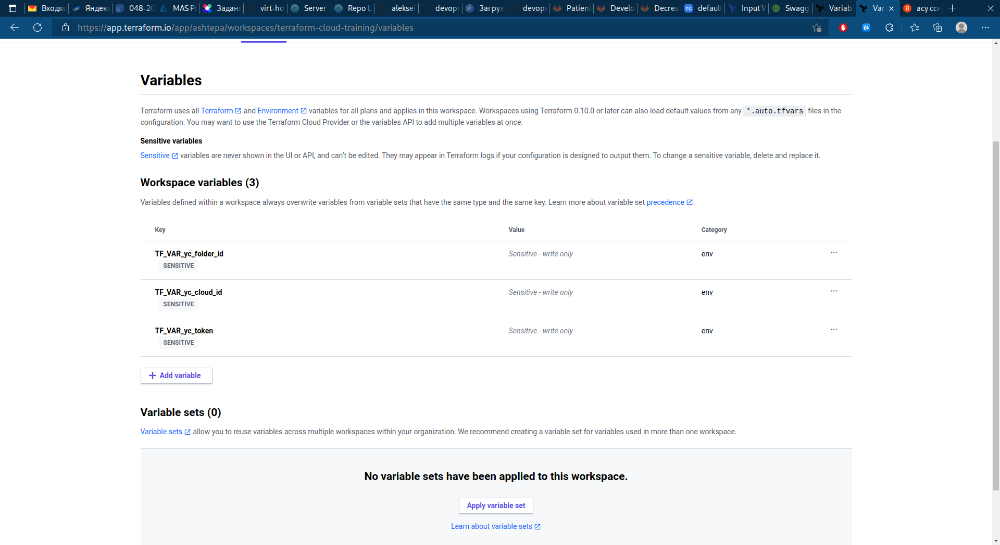
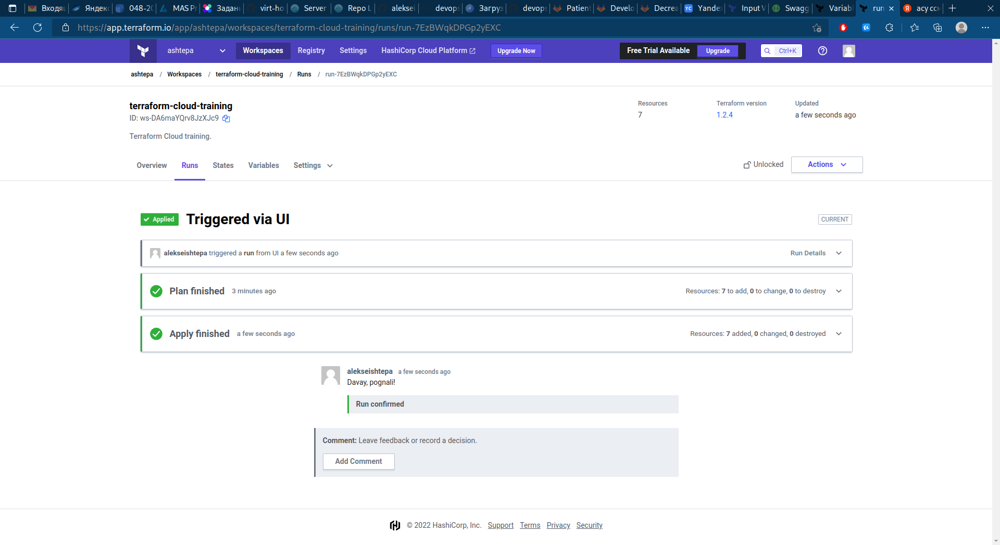
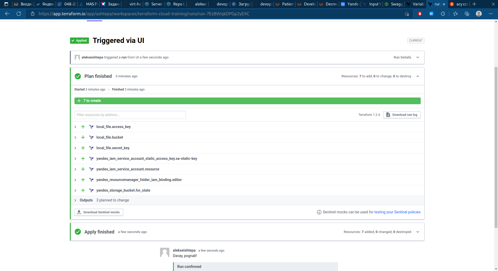

# Домашнее задание к занятию "7.4. Средства командной работы над инфраструктурой."

## Задача 1. Настроить terraform cloud (необязательно, но крайне желательно)

> В это задании предлагается познакомиться со средством командой работы над инфраструктурой предоставляемым разработчиками терраформа.
>
> 1. Зарегистрируйтесь на [https://app.terraform.io/](https://app.terraform.io/). (регистрация бесплатная и не требует использования платежных инструментов).
> 1. Создайте в своем github аккаунте (или другом хранилище репозиториев) отдельный репозиторий с  конфигурационными файлами прошлых занятий (или воспользуйтесь любым простым конфигом).
> 1. Зарегистрируйте этот репозиторий в [https://app.terraform.io/](https://app.terraform.io/).
> 1. Выполните plan и apply. 
>
> В качестве результата задания приложите снимок экрана с успешным применением конфигурации.

1. Создал отдельный [репозиторий](https://github.com/aleksei-shtepa/terraform-cloud-training) на GitHub с конфигурацией terraform. Целью конфигурации является создание корзины в Yandex Object Storage и сохранение её ключей доступа в локальных файлах.
1. Зарегистрировался на **app.terraform.io** и настроил работу с моим репозиторием из предыдущего пункта.
1. В разделе **Variables** создать три переменные окружения, которые должны содержать данные для доступа к Яндекс Облаку.

    

1. Запустил процесс **plan and apply**:

    

1. Этап **Plan** отработал нормально:

    

1. Этам **Apply** отработал нормально:

    

## Задача 2. Написать серверный конфиг для атлантиса

> Смысл задания – познакомиться с документацией о [серверной](https://www.runatlantis.io/docs/server-side-repo-config.html) конфигурации и конфигурации уровня [репозитория](https://www.runatlantis.io/docs/repo-level-atlantis-yaml.html).
>
> Создай `server.yaml` который скажет атлантису:
>
> 1. Укажите, что атлантис должен работать только для репозиториев в вашем github (или любом другом) аккаунте.
> 1. На стороне клиентского конфига разрешите изменять `workflow`, то есть для каждого репозитория можно будет указать свои дополнительные команды.
> 1. В `workflow` используемом по-умолчанию сделайте так, что бы во время планирования не происходил `lock` состояния.

Файл [server.yaml](./04-teamwork/server.yaml):

```yaml
repos:

# Atlantis должен работать только в указанном репозиториийц//
- id: github.com/aleksei-shtepa/terraform-cloud-training

  # Разрешаем использовать клиентский конфиг
  allow_custom_workflows: true

  # Разрешаем на стороне клиентского конфига изменять workflow
  allowed_overrides: [workflow]

  # Устанавливаем workflow по умолчанию
  workflow: [default]

workflows:
  default:
    plan:
      steps:
      - plan:
          # Во время планирования отключаем блокировку
          extra_args: ["-lock", "false"]
    apply:
      steps:
      - apply
```


> Создай `atlantis.yaml` который, если поместить в корень terraform проекта, скажет атлантису:
>
> 1. Надо запускать планирование и аплай для двух воркспейсов `stage` и `prod`.
> 1. Необходимо включить автопланирование при изменении любых файлов `*.tf`.

Файл [atlantis.yaml](./04-teamwork/atlantis.yaml):

```yaml
version: 3
projects:

# файлы проекта находятся в рабочем каталоге
- dir: .
  # используем terraform workspace stage
  workspace: stage
  # параметры автопланирования
  autoplan:
    # включить раздел автопланирования
    enabled: true
    # при изменении файлов terraform в рабочем каталоге и каталоге модулей
    when_modified: ["./modules/**/*.tf", "*.tf"]

# файлы проекта находятся в рабочем каталоге
- dir: .
  # используем terraform workspace prod
  workspace: prod
  # параметры автопланирования
  autoplan:
    # включить раздел автопланирования  
    enabled: true
    # при изменении файлов terraform в рабочем каталоге и каталоге модулей
    when_modified: ["./modules/**/*.tf", "*.tf"]
```

*Модули размещены в отдельном каталоге `modules` в корне проекта*.

## Задача 3. Знакомство с каталогом модулей. 

> 1. В [каталоге модулей](https://registry.terraform.io/browse/modules) найдите официальный модуль от aws для создания `ec2` инстансов. 
> 2. Изучите как устроен модуль. Задумайтесь, будете ли в своем проекте использовать этот модуль или непосредственно ресурс `aws_instance` без помощи модуля?
> 3. В рамках предпоследнего задания был создан ec2 при помощи ресурса `aws_instance`. Создайте аналогичный инстанс при помощи найденного модуля.
>
> В качестве результата задания приложите ссылку на созданный блок конфигураций.

Блок конфигураций использующий модули: [./03-basic/terraform_s3/](./03-basic/terraform_s3/)

Описание модуля, файл [./03-basic/modules/instance/instance.tf](./03-basic/modules/instance/instance.tf):

```terraform
variable image { default =  "centos-7" }
variable name { default = ""}
variable description { default =  "instance from terraform" }
variable instance_role { default =  "all" }
variable users { default = "centos"}
variable cores { default = ""}
variable platform_id { default = "standard-v1"}
variable memory { default = ""}
variable core_fraction { default = "20"}
variable subnet_id { default = ""}
variable nat { default = "false"}
variable instance_count { default = 1 }
variable count_offset { default = 0 } #start numbering from X+1 (e.g. name-1 if '0', name-3 if '2', etc.)
variable count_format { default = "%01d" } #server number format (-1, -2, etc.)
variable boot_disk { default =  "network-hdd" }
variable disk_size { default =  "20" }
variable zone { default =  "" }
variable folder_id { default =  "" }

terraform {
  required_providers {
    yandex = {
      source  = "yandex-cloud/yandex"
      version = "0.61.0"
    }
  }
}

data "yandex_compute_image" "image" {
  family = var.image
}

resource "yandex_compute_instance" "instance" {
  count = var.instance_count
  name = "${var.name}-${format(var.count_format, var.count_offset+count.index+1)}"
  platform_id = var.platform_id
  hostname = "${var.name}-${format(var.count_format, var.count_offset+count.index+1)}"
  description = var.description
  zone = var.zone
  folder_id = var.folder_id

  resources {
    cores  = var.cores
    memory = var.memory
    core_fraction = var.core_fraction
  }
  boot_disk {
    initialize_params {
      image_id = data.yandex_compute_image.image.id
      type = var.boot_disk
      size = var.disk_size
    }
  }
  network_interface {
    subnet_id = var.subnet_id
    nat       = var.nat
  }

  metadata = {
    ssh-keys = "${var.users}:${file("~/.ssh/id_ed25519.pub")}"
  }

  lifecycle {
    create_before_destroy = true
  }
}
```

Использование модуля в конфигурации [./03-basic/terraform_s3/main.tf](./03-basic/terraform_s3/main.tf):

```terraform
provider "yandex" {
  token     = var.yc_token
  cloud_id  = var.yc_cloud_id
  folder_id = var.yc_folder_id
  zone      = var.yc_region
}

terraform {
  backend "s3" {
    endpoint   = "storage.yandexcloud.net"
    key        = "terraform-07/basic-03.tfstate"
    skip_region_validation      = true
    skip_credentials_validation = true

    bucket     = "xxx"
    access_key = "yyy"
    secret_key = "zzz"
  } 
}

module "vpc" {
  source  = "hamnsk/vpc/yandex"
  version = "0.5.0"
  description = "managed by terraform"
  create_folder = length(var.yc_folder_id) > 0 ? false : true
  yc_folder_id = var.yc_folder_id
  name = terraform.workspace
  subnets = local.vpc_subnets[terraform.workspace]
}


module "instance_count" {
  source = "../modules/instance"
  instance_count = local.instance_count[terraform.workspace]

  subnet_id     = module.vpc.subnet_ids[0]
  zone = var.yc_region
  folder_id = module.vpc.folder_id
  platform_id   = "standard-v2"
  name          = "testinstance"
  description   = "Test instance Demo"
  instance_role = "testing"
  users         = "centos"
  cores         = local.cores[terraform.workspace]
  boot_disk     = "network-ssd"
  disk_size     = local.disk_size[terraform.workspace]
  nat           = "true"
  memory        = "2"
  core_fraction = "100"
  depends_on = [
    module.vpc
  ]
}

module "instance_for_each" {
  source = "../modules/instance"

  for_each = local.nodes_name

  subnet_id     = module.vpc.subnet_ids[0]
  zone = var.yc_region
  folder_id = module.vpc.folder_id
  platform_id   = "standard-v2"
  name          = "${each.key}"
  description   = "${each.value}"
  instance_role = "testing"
  users         = "centos"
  cores         = local.cores[terraform.workspace]
  boot_disk     = "network-ssd"
  disk_size     = local.disk_size[terraform.workspace]
  nat           = "true"
  memory        = "2"
  core_fraction = "100"
  depends_on = [
    module.vpc
  ]
}
```
