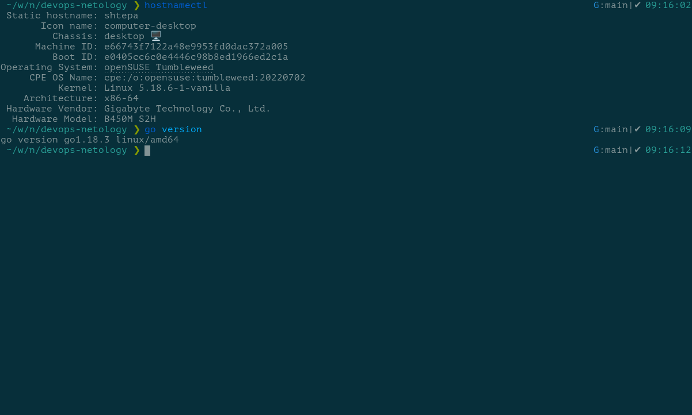
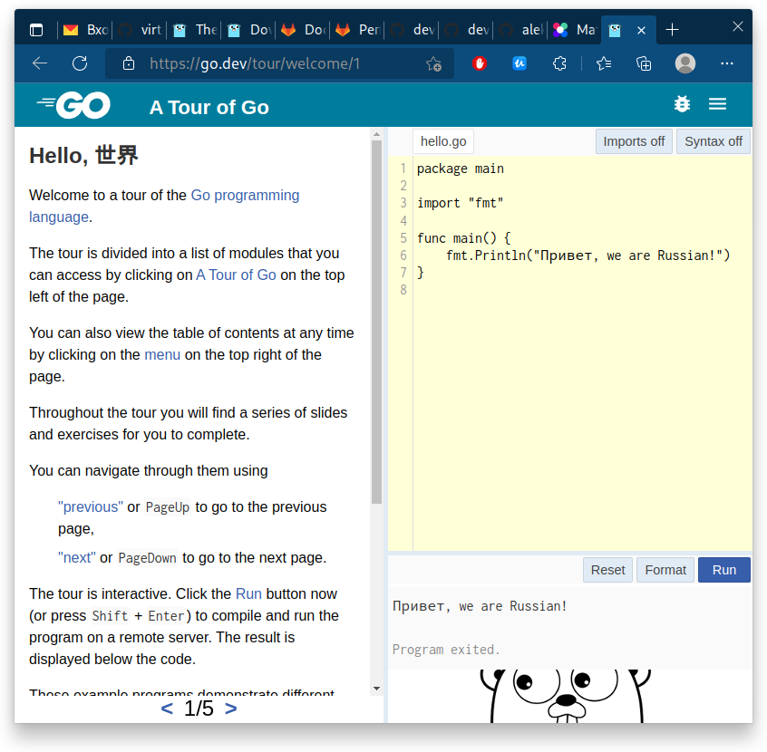

# Домашнее задание к занятию "7.5. Основы golang"

## Задача 1. Установите golang

> 1. Воспользуйтесь инструкций с официального сайта: [https://golang.org/](https://golang.org/).
> 2. Так же для тестирования кода можно использовать песочницу: [https://play.golang.org/](https://play.golang.org/).



## Задача 2. Знакомство с gotour

> У Golang есть обучающая интерактивная консоль [https://tour.golang.org/](https://tour.golang.org/).  
> Рекомендуется изучить максимальное количество примеров. В консоли уже написан необходимый код, осталось только с ним ознакомиться и поэкспериментировать как написано в инструкции в левой части экрана.  



## Задача 3. Написание кода

> Цель этого задания закрепить знания о базовом синтаксисе языка. Можно использовать редактор кода на своем компьютере, либо использовать песочницу: [https://play.golang.org/](https://play.golang.org/).
>
> 1. Напишите программу для перевода метров в футы (1 фут = 0.3048 метр). Можно запросить исходные данные у пользователя, а можно статически задать в коде. Для взаимодействия с пользователем можно использовать функцию `Scanf`:
>
>    ```go
>    package main
>    
>    import "fmt"
>    
>    func main() {
>        fmt.Print("Enter a number: ")
>        var input float64
>        fmt.Scanf("%f", &input)
>    
>        output := input * 2
>    
>        fmt.Println(output)    
>    }
>    ```

```go
package main

import "fmt"

func metr_to_foot(metr float32) float32 {
    return metr * 0.3048
}

func main() {
    fmt.Println("Конвертор длины из метров в футы.")
    fmt.Println("Вводите значения в метрах или пустое значение для выхода.")

    var iter bool = true
    var input float32

    for iter {
        fmt.Print("Значение в метрах: ")
        var n, _ = fmt.Scanf("%f", &input)
        if n > 0 {
            fmt.Println(metr_to_foot(input), "футов")
        } else {
            iter = false
        }
    }
}
```

> 2. Напишите программу, которая найдет наименьший элемент в любом заданном списке, например:
>
>    ```go
>    x := []int{48,96,86,68,57,82,63,70,37,34,83,27,19,97,9,17,}
>    ```

```go
package main

import "fmt"

func minimum(arr []int) int {
    min := arr[0]
    for _, val := range arr {
        if val < min {
            min = val
        }
    }
    return min
}

func main() {
    x := []int{48, 96, 86, 68, 57, 82, 63, 70, 37, 34, 83, 27, 19, 97, 9, 17}

    fmt.Println("Minimum = ", minimum(x))
}
```

> 3. Напишите программу, которая выводит числа от 1 до 100, которые делятся на 3. То есть `(3, 6, 9, …)`.

```go
package main

import "fmt"

func Div3(first int, last int) []int {

    var result []int

    for i := first; i <= last; i++ {
        if i%3 == 0 {
            result = append(result, i)
        }
    }

    return result
}

func main() {
    fmt.Println(Div3(1, 100))
}
```

## Задача 4. Протестировать код (не обязательно)

> Создайте тесты для функций из предыдущего задания.

Тест задания [3.1](./05-golang/3-1/3-1_test.go):

```go
package main

import "testing"

func TestMetrToFoot(t *testing.T) {
    var v float32
    v = MetrToFoot(43)
    if v != 13.1064005 {
        t.Error("Expected 13.1064005, got ", v)
    }

    v = MetrToFoot(-1)
    if v != -0.3048 {
        t.Error("Expected -0.3048, got ", v)
    }

    v = MetrToFoot(0)
    if v != 0 {
        t.Error("Expected 0, got ", v)
    }

    v = MetrToFoot(0.3)
    if v != 0.09144001 {
        t.Error("Expected 0.09144001, got ", v)
    }
}
```

Тест задания [3.2](./05-golang/3-2/3-2_test.go):

```go
package main

import "testing"

func TestMinimum(t *testing.T) {
    var v int
    v = Minimum([]int{48, 96, 86, 68, 57, 82, 63, 70, 37, 34, 83, 27, 19, 97, 9, 17})
    if v != 9 {
        t.Error("Expected 9, got ", v)
    }

    v = Minimum([]int{0})
    if v != 0 {
        t.Error("Expected 0, got ", v)
    }

    v = Minimum([]int{48, 96, 86, 68, 57, 82, 63, 70, 37, 34, 83, 27, 19, 97, 9, -17})
    if v != -17 {
        t.Error("Expected -17, got ", v)
    }

    v = Minimum([]int{48, 96, 86, 68, 57, 82, 63, 0, 37, 34, 83, 27, 19, 97, 9, 17})
    if v != 0 {
        t.Error("Expected 0, got ", v)
    }
}
```

Тест задания [3.3](./05-golang/3-3/3-3_test.go):

```go
package main

import (
    "reflect"
    "testing"
)

func check(v, etalon []int, t *testing.T) {
    if !reflect.DeepEqual(v, etalon) {
        t.Error("Expected ", etalon, " got ", v)
    }
}

func TestDiv3(t *testing.T) {

    check(
        Div3(1, 100),
        []int{3, 6, 9, 12, 15, 18, 21, 24, 27, 30, 33, 36, 39, 42, 45, 48, 51, 54, 57, 60, 63, 66, 69, 72, 75, 78, 81, 84, 87, 90, 93, 96, 99},
        t)

    check(
        Div3(0, 101),
        []int{0, 3, 6, 9, 12, 15, 18, 21, 24, 27, 30, 33, 36, 39, 42, 45, 48, 51, 54, 57, 60, 63, 66, 69, 72, 75, 78, 81, 84, 87, 90, 93, 96, 99},
        t)

    check(
        Div3(30, 60),
        []int{30, 33, 36, 39, 42, 45, 48, 51, 54, 57, 60},
        t)

    check(
        Div3(3, 3),
        []int{3},
        t)
}
```
